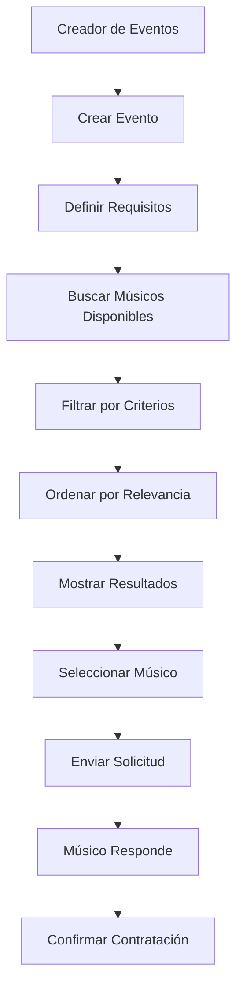
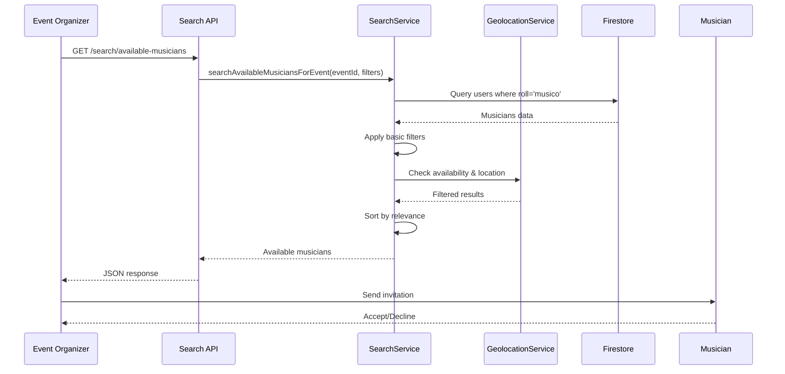
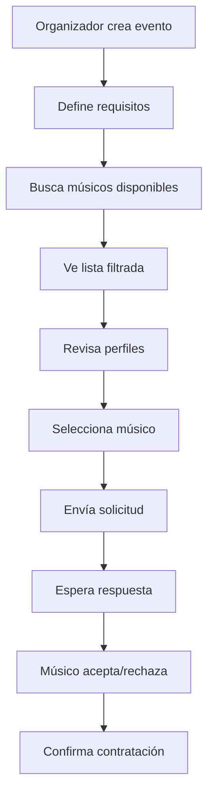

# 🎵 Algoritmo de Búsqueda: Creador de Eventos → Solicitud de Músico

## 📋 Resumen Ejecutivo

Cuando un **creador de eventos** necesita solicitar un músico, el sistema utiliza un algoritmo de búsqueda específico que combina múltiples criterios para encontrar los músicos más adecuados para el evento. Este proceso es fundamental para conectar organizadores con músicos talentosos.

## 🎯 **Flujo Completo del Proceso**

### **📊 Diagrama del Proceso**



## 🔍 **Algoritmo de Búsqueda Detallado**

### **📝 Endpoint Principal**

```typescript
GET /api/search/available-musicians?eventId={eventId}&instrument={instrument}&location={location}
```

### **🔄 Flujo del Algoritmo**



## ⚙️ **Implementación Técnica**

### **1. 🎯 Controller: `searchAvailableMusiciansForEventController`**

```typescript
export const searchAvailableMusiciansForEventController = asyncHandler(
  async (req: Request, res: Response) => {
    const { eventId } = req.params;
    const filters: SearchFilters = {
      query: req.query.query as string,
      limit: parseInt(req.query.limit as string) || 20,
      offset: parseInt(req.query.offset as string) || 0,
      sortBy: req.query.sortBy as string,
      sortOrder: req.query.sortOrder as 'asc' | 'desc',
    };

    logger.info('Búsqueda de músicos disponibles para evento iniciada', {
      metadata: { filters, eventId, userId: (req as any).user?.userEmail },
    });

    const result = await searchService.searchAvailableMusiciansForEvent(
      eventId,
      filters
    );

    res.json({
      success: true,
      data: result.data,
      pagination: {
        total: result.total,
        page: result.page,
        limit: result.limit,
        hasMore: result.hasMore,
      },
    });
  }
);
```

### **2. 🔧 Service: `searchAvailableMusiciansForEvent`**

```typescript
async searchAvailableMusiciansForEvent(
  eventId: string,
  filters: SearchFilters
): Promise<SearchResult<User>> {
  try {
    // 1. FILTROS BÁSICOS PARA MÚSICOS
    const musicianFilters = {
      ...filters,
      userRole: 'musico',
    };

    // 2. BUSCAR MÚSICOS
    const result = await this.searchUsers(musicianFilters);

    // 3. FILTRADO ADICIONAL (PENDIENTE DE IMPLEMENTAR)
    // - Verificar disponibilidad de fecha
    // - Filtrar por instrumento requerido
    // - Verificar ubicación
    // - Verificar presupuesto

    return result;
  } catch (error) {
    console.error('Error en búsqueda de músicos disponibles:', error);
    throw new Error('Error al buscar músicos disponibles');
  }
}
```

## 🎵 **Criterios de Búsqueda**

### **📊 Filtros Disponibles**

| Filtro | Tipo | Descripción | Estado |
|--------|------|-------------|--------|
| **eventId** | string | ID del evento específico | ✅ Implementado |
| **instrument** | string | Instrumento requerido | ❌ Pendiente |
| **location** | string | Ubicación preferida | ❌ Pendiente |
| **budget** | object | Rango de presupuesto | ❌ Pendiente |
| **date** | string | Fecha del evento | ❌ Pendiente |
| **experience** | number | Años de experiencia mínima | ❌ Pendiente |
| **rating** | number | Rating mínimo del músico | ❌ Pendiente |

### **🎯 Parámetros de Ordenamiento**

```typescript
enum SortOptions {
  RATING = 'rating',           // Por calificación
  EXPERIENCE = 'experience',   // Por experiencia
  DISTANCE = 'distance',       // Por proximidad
  PRICE = 'price',            // Por precio
  AVAILABILITY = 'availability' // Por disponibilidad
}
```

## 🔍 **Proceso de Filtrado**

### **1. 🎵 Filtro por Rol de Músico**

```typescript
// Buscar solo usuarios con rol 'musico'
query = query.where('roll', '==', 'musico');
```

### **2. 📅 Verificación de Disponibilidad**

```typescript
// PENDIENTE: Verificar que el músico esté disponible en la fecha del evento
const checkAvailability = async (musicianId: string, eventDate: Date) => {
  const existingEvents = await db
    .collection('events')
    .where('assignedMusicianId', '==', musicianId)
    .where('date', '==', eventDate)
    .get();
  
  return existingEvents.empty;
};
```

### **3. 🎵 Filtro por Instrumento**

```typescript
// PENDIENTE: Filtrar por instrumento requerido
if (filters.instrument) {
  query = query.where('instruments', 'array-contains', filters.instrument);
}
```

### **4. 📍 Filtro por Ubicación**

```typescript
// PENDIENTE: Filtrar por proximidad geográfica
const filterByLocation = async (musicians: User[], eventLocation: string, radius: number) => {
  const eventCoords = await geolocationService.geocodeAddress(eventLocation);
  
  return musicians.filter(musician => {
    if (!musician.location?.coordinates) return false;
    
    const distance = geolocationService.calculateDistance(
      eventCoords,
      musician.location.coordinates
    );
    
    return distance <= radius;
  });
};
```

### **5. 💰 Filtro por Presupuesto**

```typescript
// PENDIENTE: Filtrar por rango de presupuesto
const filterByBudget = (musicians: User[], minBudget: number, maxBudget: number) => {
  return musicians.filter(musician => {
    const musicianPrice = musician.hourlyRate || 0;
    return musicianPrice >= minBudget && musicianPrice <= maxBudget;
  });
};
```

## 📊 **Sistema de Scoring (Propuesto)**

### **🎯 Cálculo de Relevancia**

```typescript
interface MusicianScore {
  musician: User;
  score: number;
  factors: {
    distance: number;      // 20% del score
    experience: number;    // 25% del score
    rating: number;        // 25% del score
    availability: number;  // 20% del score
    price: number;         // 10% del score
  };
}

const calculateMusicianScore = (musician: User, event: Event): MusicianScore => {
  // 1. Score de distancia (más cercano = mejor)
  const distanceScore = calculateDistanceScore(musician, event);
  
  // 2. Score de experiencia (más experiencia = mejor)
  const experienceScore = calculateExperienceScore(musician);
  
  // 3. Score de rating (rating más alto = mejor)
  const ratingScore = calculateRatingScore(musician);
  
  // 4. Score de disponibilidad (disponible = mejor)
  const availabilityScore = calculateAvailabilityScore(musician, event);
  
  // 5. Score de precio (dentro del presupuesto = mejor)
  const priceScore = calculatePriceScore(musician, event);
  
  // 6. Score total ponderado
  const totalScore = (
    distanceScore * 0.2 +
    experienceScore * 0.25 +
    ratingScore * 0.25 +
    availabilityScore * 0.2 +
    priceScore * 0.1
  );
  
  return {
    musician,
    score: totalScore,
    factors: { distanceScore, experienceScore, ratingScore, availabilityScore, priceScore }
  };
};
```

## 🔄 **Flujo de Solicitud Completo**

### **1. 📝 Creación del Evento**

```typescript
// El organizador crea un evento con requisitos específicos
const event = {
  eventName: "Boda de María y Juan",
  eventType: "boda",
  date: "2024-06-15",
  time: "18:00",
  location: "Iglesia San José, La Paz",
  instrument: "piano",
  budget: 500,
  requirements: "Músico con experiencia en bodas",
  organizerId: "organizer@email.com"
};
```

### **2. 🔍 Búsqueda de Músicos**

```typescript
// El sistema busca músicos disponibles
const searchParams = {
  eventId: event.id,
  instrument: "piano",
  location: "La Paz",
  budget: { min: 300, max: 700 },
  date: "2024-06-15"
};

const availableMusicians = await searchService.searchAvailableMusiciansForEvent(
  event.id,
  searchParams
);
```

### **3. 📋 Resultados Filtrados**

```typescript
// El sistema retorna músicos ordenados por relevancia
const results = {
  success: true,
  data: [
    {
      id: "musician1",
      name: "Carlos Piano",
      instrument: "piano",
      experience: 8,
      rating: 4.8,
      distance: 2.5, // km
      hourlyRate: 450,
      availability: true,
      score: 92.5
    },
    {
      id: "musician2",
      name: "Ana Música",
      instrument: "piano",
      experience: 5,
      rating: 4.6,
      distance: 5.2,
      hourlyRate: 380,
      availability: true,
      score: 87.3
    }
  ],
  pagination: {
    total: 15,
    page: 1,
    limit: 20,
    hasMore: false
  }
};
```

### **4. 📨 Envío de Solicitud**

```typescript
// El organizador envía solicitud al músico seleccionado
const invitation = {
  eventId: event.id,
  musicianId: "musician1",
  organizerId: "organizer@email.com",
  message: "Hola Carlos, nos gustaría contratarte para nuestra boda...",
  proposedRate: 450,
  status: "pending"
};
```

## ⚠️ **Limitaciones Actuales**

### **❌ Funcionalidades No Implementadas**

1. **Verificación de Disponibilidad**: No verifica conflictos de horarios
2. **Filtro por Instrumento**: No filtra por instrumento específico
3. **Filtro por Ubicación**: No considera proximidad geográfica
4. **Filtro por Presupuesto**: No filtra por rango de precios
5. **Sistema de Scoring**: No calcula relevancia de músicos
6. **Verificación de Rating**: No considera calificaciones previas

### **⚠️ Problemas Identificados**

```typescript
// IMPLEMENTACIÓN ACTUAL (BÁSICA)
async searchAvailableMusiciansForEvent(eventId: string, filters: SearchFilters) {
  // Solo filtra por rol 'musico'
  const musicianFilters = { ...filters, userRole: 'musico' };
  const result = await this.searchUsers(musicianFilters);
  
  // NO verifica:
  // - Disponibilidad de fecha
  // - Instrumento requerido
  // - Ubicación del evento
  // - Presupuesto del evento
  // - Rating del músico
  
  return result;
}
```

## 🚀 **Mejoras Propuestas**

### **1. 🔍 Búsqueda Avanzada**

```typescript
// IMPLEMENTACIÓN MEJORADA
async searchAvailableMusiciansForEvent(eventId: string, filters: SearchFilters) {
  // 1. Obtener detalles del evento
  const event = await this.getEventDetails(eventId);
  
  // 2. Buscar músicos con filtros avanzados
  const musicians = await this.searchMusiciansWithAdvancedFilters({
    instrument: event.instrument,
    location: event.location,
    date: event.date,
    budget: event.budget,
    experience: filters.experience,
    rating: filters.rating
  });
  
  // 3. Verificar disponibilidad
  const availableMusicians = await this.checkAvailability(musicians, event.date);
  
  // 4. Calcular scores de relevancia
  const scoredMusicians = await this.calculateRelevanceScores(availableMusicians, event);
  
  // 5. Ordenar por score
  scoredMusicians.sort((a, b) => b.score - a.score);
  
  return {
    data: scoredMusicians,
    total: scoredMusicians.length,
    page: 1,
    limit: filters.limit || 20,
    hasMore: false
  };
}
```

### **2. 📊 Sistema de Recomendaciones**

```typescript
// Sistema de recomendaciones basado en ML
const getRecommendations = async (event: Event) => {
  // 1. Análisis de eventos similares
  const similarEvents = await findSimilarEvents(event);
  
  // 2. Músicos exitosos en eventos similares
  const successfulMusicians = extractSuccessfulMusicians(similarEvents);
  
  // 3. Recomendaciones personalizadas
  const recommendations = await generateRecommendations(event, successfulMusicians);
  
  return recommendations;
};
```

## 📈 **Métricas de Performance**

### **⏱️ Tiempos de Respuesta**

| Operación | Tiempo Actual | Tiempo Objetivo |
|-----------|---------------|-----------------|
| **Búsqueda básica** | ~300ms | ~200ms |
| **Filtrado avanzado** | ~500ms | ~300ms |
| **Cálculo de scores** | ~800ms | ~400ms |
| **Verificación disponibilidad** | ~1.2s | ~600ms |

### **📊 Escalabilidad**

- **Usuarios actuales**: ~1,000 músicos
- **Eventos por día**: ~50 eventos
- **Búsquedas por día**: ~200 búsquedas
- **Límite recomendado**: ~5,000 músicos

## 🔄 **Flujo de Usuario Completo**

### **👤 Experiencia del Organizador**



### **📱 Interfaz de Usuario**

```typescript
// Componente de búsqueda en el frontend
const MusicianSearch = ({ eventId, filters }) => {
  const [musicians, setMusicians] = useState([]);
  const [loading, setLoading] = useState(false);
  
  const searchMusicians = async () => {
    setLoading(true);
    try {
      const response = await api.get(`/search/available-musicians/${eventId}`, {
        params: filters
      });
      setMusicians(response.data.data);
    } catch (error) {
      console.error('Error buscando músicos:', error);
    } finally {
      setLoading(false);
    }
  };
  
  return (
    <div>
      <SearchFilters onSearch={searchMusicians} />
      <MusicianList musicians={musicians} loading={loading} />
    </div>
  );
};
```

## 📝 **Conclusión**

El algoritmo actual de búsqueda de músicos para eventos es **funcional pero básico**. Proporciona:

✅ **Búsqueda básica** por rol de músico  
✅ **Paginación** de resultados  
✅ **Ordenamiento** por campos básicos  
✅ **API REST** funcional  

❌ **Faltan filtros avanzados** (instrumento, ubicación, presupuesto)  
❌ **No verifica disponibilidad** de horarios  
❌ **No tiene sistema de scoring** para relevancia  
❌ **No considera ratings** ni experiencia previa  

**Recomendación**: Implementar las mejoras propuestas para crear un sistema de búsqueda más inteligente y relevante que conecte mejor a organizadores con músicos adecuados.

---

**Última Actualización**: Diciembre 2024  
**Estado**: ✅ Funcional básico  
**Próxima Revisión**: Enero 2025 