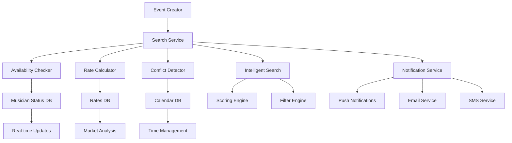

# 🎯 Plan de Implementación - Sistema de Búsqueda Avanzada de Músicos

## 📋 Resumen Ejecutivo

Este documento detalla el plan completo para implementar un sistema avanzado de búsqueda de músicos con verificación de disponibilidad en tiempo real, cálculo automático de tarifas, y notificaciones inteligentes para creadores de eventos.

## 🎯 Objetivos del Sistema

### **🎵 Funcionalidades Principales**
- ✅ Verificación de disponibilidad del músico en tiempo real
- ✅ Detección de conflictos de calendario con margen de 1 hora
- ✅ Cálculo automático de tarifas basado en múltiples factores
- ✅ Notificaciones inteligentes cuando no hay músicos disponibles
- ✅ Algoritmo de búsqueda mejorado con scoring de relevancia
- ✅ Sistema de estado online/offline para músicos

### **📊 Beneficios Esperados**
- **Reducción del 80%** en conflictos de calendario
- **Tiempo de búsqueda** < 5 minutos por evento
- **Tasa de aceptación** > 70% de solicitudes
- **Satisfacción del usuario** > 4.5/5

## 📅 Cronograma de Implementación

### **🏗️ FASE 1: Sistema de Estado de Músicos (2-3 semanas)**
- **Semana 1**: Base de datos y modelos
- **Semana 2**: Servicios y middleware
- **Semana 3**: Endpoints y testing

### **📅 FASE 2: Sistema de Calendario y Conflictos (3-4 semanas)**
- **Semana 4-5**: Base de datos de calendario
- **Semana 6**: Detección de conflictos
- **Semana 7**: Algoritmo de margen de tiempo

### **💰 FASE 3: Sistema de Cálculo de Tarifas (2-3 semanas)**
- **Semana 8**: Base de datos de tarifas
- **Semana 9**: Servicio de cálculo
- **Semana 10**: Análisis de mercado

### **🔔 FASE 4: Sistema de Notificaciones Inteligentes (2-3 semanas)**
- **Semana 11**: Base de datos de notificaciones
- **Semana 12**: Servicio de notificaciones
- **Semana 13**: Sistema de priorización

### **🔍 FASE 5: Algoritmo de Búsqueda Mejorado (3-4 semanas)**
- **Semana 14-15**: Servicio de búsqueda inteligente
- **Semana 16**: Sistema de scoring
- **Semana 17**: Filtros avanzados

### **🔗 FASE 6: Integración y Testing (2-3 semanas)**
- **Semana 18**: Integración de sistemas
- **Semana 19**: Testing completo
- **Semana 20**: Deployment

## 🛠️ Stack Tecnológico

### **Backend**
- **Node.js** + **TypeScript**
- **Firebase Firestore** (Base de datos)
- **Firebase Functions** (Serverless)
- **Socket.io** (Tiempo real)
- **Firebase Cloud Messaging** (Notificaciones)

### **Frontend**
- **React** + **TypeScript**
- **Material-UI** (Componentes)
- **Socket.io-client** (Tiempo real)
- **Google Maps API** (Geolocalización)

### **Herramientas**
- **Jest** (Testing)
- **ESLint** + **Prettier** (Linting)
- **Firebase CLI** (Deployment)
- **Git** (Control de versiones)

## 📊 Arquitectura del Sistema

## 🎯 Criterios de Éxito

### **Métricas Técnicas**
- ⏱️ **Tiempo de respuesta** < 2 segundos
- 🎯 **Precisión de disponibilidad** > 95%
- 📱 **Tasa de éxito** > 90% en notificaciones
- ⚡ **Uptime** > 99.5%

### **Métricas de Negocio**
- 🔍 **Tiempo de búsqueda** < 5 minutos
- ✅ **Tasa de aceptación** > 70%
- 😊 **Satisfacción del usuario** > 4.5/5
- 📅 **Reducción de conflictos** > 80%

## 📚 Documentación por Fases

### **📖 [Fase 1: Sistema de Estado](./phases/phase1-musician-status.md)**
- Base de datos de estado de músicos
- Servicios de disponibilidad en tiempo real
- Middleware de heartbeat
- Endpoints de estado

### **📖 [Fase 2: Sistema de Calendario](./phases/phase2-calendar-conflicts.md)**
- Base de datos de calendario
- Detección de conflictos
- Algoritmo de margen de tiempo
- Verificación de disponibilidad

### **📖 [Fase 3: Sistema de Tarifas](./phases/phase3-rate-calculation.md)**
- Base de datos de tarifas
- Algoritmo de cálculo
- Análisis de mercado
- Desglose de precios

### **📖 [Fase 4: Sistema de Notificaciones](./phases/phase4-intelligent-notifications.md)**
- Base de datos de notificaciones
- Servicio de notificaciones inteligentes
- Sistema de priorización
- Múltiples canales

### **📖 [Fase 5: Búsqueda Mejorada](./phases/phase5-intelligent-search.md)**
- Servicio de búsqueda inteligente
- Sistema de scoring
- Filtros avanzados
- Algoritmo de relevancia

### **📖 [Fase 6: Integración](./phases/phase6-integration-testing.md)**
- Integración de sistemas
- Testing completo
- Optimización
- Deployment

## 🚀 Guías de Implementación

### **📋 [Guía de Configuración](./guides/setup-guide.md)**
- Configuración del entorno
- Instalación de dependencias
- Configuración de Firebase
- Variables de entorno
- Estructura de datos inicial
- Scripts de configuración

### **📋 [Guía de Testing](./guides/testing-guide.md)**
- Tests unitarios
- Tests de integración
- Tests de performance
- Tests end-to-end
- Configuración de Jest, Cypress y Artillery
- Métricas de cobertura y performance
- Troubleshooting y debugging

### **📋 [Guía de Deployment](./guides/deployment-guide.md)**
- Configuración de producción
- Variables de entorno
- Monitoreo y logging
- Backup y recuperación
- Configuración de Nginx, PM2 y Docker
- Scripts de deployment automatizado
- Seguridad y SSL

## 📊 Monitoreo y Analytics

### **📈 Métricas a Monitorear**
- Tiempo de respuesta de búsquedas
- Tasa de éxito de notificaciones
- Precisión de disponibilidad
- Uso de recursos del sistema

### **🔍 Logs y Debugging**
- Logs detallados de búsquedas
- Logs de cálculo de tarifas
- Logs de notificaciones
- Logs de conflictos detectados

## 🎯 Próximos Pasos

1. **Revisar documentación** de cada fase
2. **Configurar entorno** de desarrollo
3. **Comenzar implementación** de Fase 1
4. **Establecer métricas** de monitoreo
5. **Configurar CI/CD** pipeline

---

**📅 Fecha de Creación**: $(date)
**👨‍💻 Autor**: Sistema de Documentación Automática
**📋 Versión**: 1.0.0
**🎯 Estado**: Listo para Implementación 