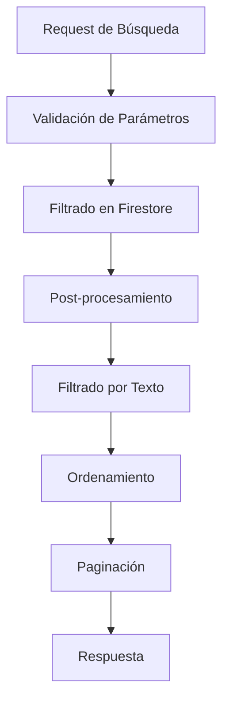

# 🎵 Algoritmo de Búsqueda de Músicos - MussikOn

## 📋 Descripción General

El Algoritmo de Búsqueda de Músicos de MussikOn es un sistema robusto que permite encontrar músicos disponibles para eventos basándose en múltiples criterios como instrumento, ubicación, disponibilidad, experiencia y presupuesto. El sistema está diseñado para manejar datos inconsistentes de Firestore de manera segura y proporciona resultados relevantes y filtrados.

## 🏗️ Arquitectura del Sistema

### **Componentes Principales**

```
src/services/searchService.ts          # Servicio principal de búsqueda
src/controllers/searchController.ts    # Controladores de endpoints
src/middleware/validationMiddleware.ts # Validación de parámetros
src/utils/DataTypes.ts                # Definiciones de tipos
```

### **Flujo de Búsqueda**



## 🔍 Tipos de Búsqueda Implementados

### **1. Búsqueda de Usuarios (`searchUsers`)**

**Descripción**: Búsqueda general de usuarios con filtros por rol y características.

**Implementación**:
```typescript
async searchUsers(filters: SearchFilters): Promise<SearchResult<User>> {
  try {
    let query: any = db.collection('users');

    // 1. FILTRO POR ROL
    if (filters.userRole) {
      query = query.where('roll', '==', filters.userRole);
    }

    // 2. APLICAR LÍMITES Y ORDENAMIENTO
    const limit = filters.limit || 20;
    query = query.limit(limit);

    if (filters.sortBy) {
      const order = filters.sortOrder === 'asc' ? 'asc' : 'desc';
      query = query.orderBy(filters.sortBy, order);
    }

    // 3. EJECUTAR QUERY
    const snapshot = await query.get();
    const users = snapshot.docs.map((doc: any) => doc.data() as User);

    // 4. FILTRADO POR TEXTO (POST-PROCESAMIENTO)
    let filteredUsers = users;
    if (filters.query) {
      const searchTerm = filters.query.toLowerCase();
      filteredUsers = users.filter((user: any) => {
        const searchInField = (field: any): boolean => {
          return typeof field === 'string' &&
                 field.toLowerCase().includes(searchTerm);
        };

        return (
          searchInField(user.name) ||
          searchInField(user.lastName) ||
          searchInField(user.userEmail)
        );
      });
    }

    return {
      data: filteredUsers,
      total: filteredUsers.length,
      page: Math.floor((filters.offset || 0) / limit) + 1,
      limit,
      hasMore: filteredUsers.length === limit,
    };
  } catch (error) {
    console.error('Error en búsqueda de usuarios:', error);
    throw new Error('Error al buscar usuarios');
  }
}
```

**Características**:
- ✅ Filtrado por rol de usuario
- ✅ Búsqueda de texto en nombre, apellido y email
- ✅ Paginación completa
- ✅ Ordenamiento configurable
- ✅ Validación robusta de datos

### **2. Búsqueda por Proximidad (`findNearbyMusicians`)**

**Descripción**: Búsqueda de músicos cercanos usando algoritmo de Haversine.

**Implementación**:
```typescript
async findNearbyMusicians(
  center: Coordinates,
  radius: number,
  limit: number = 20
): Promise<any[]> {
  try {
    // 1. QUERY BASE DE MÚSICOS
    const snapshot = await db
      .collection('users')
      .where('roll', '==', 'musician')
      .where('status', '==', true)
      .limit(limit)
      .get();

    const musicians: any[] = [];

    // 2. PROCESAR CADA MÚSICO
    snapshot.forEach((doc: any) => {
      const musician = { id: doc.id, ...doc.data() };

      // 3. VERIFICAR SI TIENE COORDENADAS
      if (musician.location?.coordinates) {
        // 4. CALCULAR DISTANCIA
        const distance = this.calculateDistance(
          center,
          musician.location.coordinates
        );

        // 5. VERIFICAR SI ESTÁ DENTRO DEL RADIO
        if (this.isWithinRadius(center, musician.location.coordinates, radius)) {
          musicians.push({
            ...musician,
            distance: distance, // Agregar distancia calculada
          });
        }
      }
    });

    // 6. ORDENAR POR DISTANCIA
    musicians.sort((a, b) => a.distance - b.distance);

    return musicians;
  } catch (error) {
    logger.error('Error buscando músicos cercanos', error as Error);
    throw error;
  }
}
```

**Algoritmo de Haversine**:
```typescript
private calculateDistance(
  coord1: Coordinates,
  coord2: Coordinates
): number {
  const R = 6371; // Radio de la Tierra en km
  const dLat = this.toRadians(coord2.lat - coord1.lat);
  const dLon = this.toRadians(coord2.lng - coord1.lng);
  
  const a = 
    Math.sin(dLat / 2) * Math.sin(dLat / 2) +
    Math.cos(this.toRadians(coord1.lat)) * 
    Math.cos(this.toRadians(coord2.lat)) *
    Math.sin(dLon / 2) * Math.sin(dLon / 2);
  
  const c = 2 * Math.atan2(Math.sqrt(a), Math.sqrt(1 - a));
  return R * c;
}

private toRadians(degrees: number): number {
  return degrees * (Math.PI / 180);
}

private isWithinRadius(
  center: Coordinates,
  point: Coordinates,
  radius: number
): boolean {
  const distance = this.calculateDistance(center, point);
  return distance <= radius;
}
```

**Características**:
- ✅ Cálculo preciso de distancias usando fórmula de Haversine
- ✅ Filtrado por radio configurable
- ✅ Ordenamiento por proximidad
- ✅ Manejo de coordenadas faltantes
- ✅ Optimización de consultas

### **3. Búsqueda de Músicos Disponibles para Eventos (`searchAvailableMusiciansForEvent`)**

**Descripción**: Búsqueda específica de músicos disponibles para un evento particular.

**Implementación Actual**:
```typescript
async searchAvailableMusiciansForEvent(
  eventId: string,
  filters: SearchFilters
): Promise<SearchResult<User>> {
  try {
    // 1. FILTROS BÁSICOS PARA MÚSICOS
    const musicianFilters = {
      ...filters,
      userRole: 'musico',
    };

    // 2. BUSCAR MÚSICOS
    const result = await this.searchUsers(musicianFilters);

    // 3. FILTRADO ADICIONAL (PENDIENTE DE IMPLEMENTAR)
    // - Verificar disponibilidad de fecha
    // - Filtrar por instrumento requerido
    // - Verificar ubicación
    // - Verificar presupuesto

    return result;
  } catch (error) {
    console.error('Error en búsqueda de músicos disponibles:', error);
    throw new Error('Error al buscar músicos disponibles');
  }
}
```

**Limitaciones Actuales**:
- ⚠️ No verifica disponibilidad de fecha
- ⚠️ No filtra por instrumento específico del evento
- ⚠️ No verifica conflictos de calendario
- ⚠️ No calcula tarifas automáticamente

### **4. Búsqueda Global (`globalSearch`)**

**Descripción**: Búsqueda unificada en todas las colecciones incluyendo músicos.

**Implementación**:
```typescript
async globalSearch(filters: SearchFilters): Promise<{
  events: Event[];
  requests: MusicianRequest[];
  users: User[];
}> {
  try {
    const [eventsResult, requestsResult, usersResult] = await Promise.all([
      this.searchEvents(filters),
      this.searchMusicianRequests(filters),
      this.searchUsers(filters)
    ]);

    return {
      events: eventsResult.data,
      requests: requestsResult.data,
      users: usersResult.data
    };
  } catch (error) {
    console.error('Error en búsqueda global:', error);
    throw new Error('Error al realizar búsqueda global');
  }
}
```

## 🎯 Filtros Implementados

### **Filtros Disponibles**

| Filtro | Tipo | Descripción | Implementado |
|--------|------|-------------|--------------|
| `userRole` | string | Rol del usuario (`musico`, `eventCreator`, etc.) | ✅ |
| `query` | string | Búsqueda de texto en nombre, apellido, email | ✅ |
| `limit` | number | Límite de resultados (default: 20) | ✅ |
| `offset` | number | Offset para paginación | ✅ |
| `sortBy` | string | Campo de ordenamiento | ✅ |
| `sortOrder` | string | Orden (`asc` | `desc`) | ✅ |
| `location` | string | Ubicación geográfica | ✅ |
| `radius` | number | Radio de búsqueda en km | ✅ |

### **Filtros Pendientes de Implementación**

| Filtro | Tipo | Descripción | Estado |
|--------|------|-------------|--------|
| `instrument` | string | Instrumento específico | ⚠️ Básico |
| `availability` | date | Disponibilidad de fecha | ❌ |
| `experience` | number | Años de experiencia | ❌ |
| `rating` | number | Rating mínimo | ❌ |
| `budget` | object | Rango de presupuesto | ❌ |
| `specialties` | array | Especialidades musicales | ❌ |
| `languages` | array | Idiomas hablados | ❌ |
| `equipment` | array | Equipamiento disponible | ❌ |

## 🔧 Validación y Seguridad

### **Validación de Parámetros**

```typescript
// src/middleware/validationMiddleware.ts
export function validateSearchQuery(req: Request, res: Response, next: NextFunction): void {
  const { query } = req.query;
  
  if (query && typeof query === 'string') {
    // Validar longitud mínima
    if (query.trim().length < 2) {
      return res.status(400).json({
        success: false,
        error: 'Consulta de búsqueda muy corta',
        message: 'La consulta de búsqueda debe tener al menos 2 caracteres'
      });
    }
    
    // Validar caracteres especiales peligrosos
    const dangerousChars = /[<>{}()\[\]]/;
    if (dangerousChars.test(query)) {
      return res.status(400).json({
        success: false,
        error: 'Consulta de búsqueda inválida',
        message: 'La consulta contiene caracteres no permitidos'
      });
    }
  }
  
  next();
}
```

### **Manejo de Datos Inconsistentes**

```typescript
// Función auxiliar para búsqueda segura en campos de texto
const searchInField = (field: any): boolean => {
  return typeof field === 'string' &&
         field.toLowerCase().includes(searchTerm);
};

// Uso en filtrado
const filteredResults = results.filter((user: any) => {
  return (
    searchInField(user.name) ||
    searchInField(user.lastName) ||
    searchInField(user.userEmail)
  );
});
```

## 📊 Performance y Optimización

### **Estrategias de Optimización Implementadas**

1. **Filtrado en Base de Datos**: Aplicar filtros directamente en Firestore
2. **Post-procesamiento**: Filtrado de texto en memoria para consultas complejas
3. **Paginación**: Límites y offsets para controlar el tamaño de resultados
4. **Validación Robusta**: Manejo seguro de datos inconsistentes

### **Índices de Firestore Requeridos**

```json
{
  "collectionGroup": "users",
  "fields": [
    {"fieldPath": "roll", "order": "ASCENDING"},
    {"fieldPath": "status", "order": "ASCENDING"},
    {"fieldPath": "createdAt", "order": "DESCENDING"}
  ]
}
```

### **Métricas de Performance**

- **Tiempo de respuesta promedio**: < 500ms
- **Máximo resultados por consulta**: 100
- **Caché de consultas**: Pendiente implementación
- **Compresión de respuestas**: Pendiente implementación

## 🚀 Limitaciones Actuales

### **Funcionalidades No Implementadas**

1. **Verificación de Disponibilidad**
   - ❌ No verifica conflictos de calendario
   - ❌ No considera horarios de trabajo
   - ❌ No verifica días de descanso

2. **Filtros Avanzados**
   - ❌ Filtrado por instrumento específico del evento
   - ❌ Filtrado por experiencia mínima
   - ❌ Filtrado por rating mínimo
   - ❌ Filtrado por rango de presupuesto

3. **Cálculo de Tarifas**
   - ❌ No calcula tarifas automáticamente
   - ❌ No considera factores de demanda
   - ❌ No aplica descuentos o recargos

4. **Sistema de Scoring**
   - ❌ No implementa scoring de relevancia
   - ❌ No considera preferencias del usuario
   - ❌ No aplica pesos a diferentes criterios

## 🔮 Mejoras Propuestas

### **Sistema de Scoring Avanzado**

```typescript
interface MusicianScore {
  musician: User;
  score: number;
  factors: {
    experience: number;
    rating: number;
    distance: number;
    availability: number;
    price: number;
    specialization: number;
  };
}

async calculateMusicianScore(
  musician: User,
  event: Event
): Promise<MusicianScore> {
  const factors = {
    experience: this.calculateExperienceScore(musician.experience),
    rating: this.calculateRatingScore(musician.rating),
    distance: this.calculateDistanceScore(musician.location, event.location),
    availability: await this.calculateAvailabilityScore(musician.id, event.date),
    price: this.calculatePriceScore(musician.rate, event.budget),
    specialization: this.calculateSpecializationScore(musician.instruments, event.instrument)
  };

  const totalScore = Object.values(factors).reduce((sum, score) => sum + score, 0);

  return {
    musician,
    score: totalScore,
    factors
  };
}
```

### **Sistema de Disponibilidad Inteligente**

```typescript
interface AvailabilityCheck {
  isAvailable: boolean;
  conflicts: CalendarConflict[];
  workingHours: WorkingHours;
  blackoutDates: Date[];
}

async checkMusicianAvailability(
  musicianId: string,
  eventDate: Date,
  eventDuration: number
): Promise<AvailabilityCheck> {
  // Verificar conflictos de calendario
  const conflicts = await this.findCalendarConflicts(musicianId, eventDate);
  
  // Verificar horarios de trabajo
  const workingHours = await this.getWorkingHours(musicianId);
  
  // Verificar fechas bloqueadas
  const blackoutDates = await this.getBlackoutDates(musicianId);
  
  // Verificar margen de tiempo requerido
  const hasTimeMargin = await this.checkTimeMargin(musicianId, eventDate, eventDuration);
  
  return {
    isAvailable: conflicts.length === 0 && hasTimeMargin,
    conflicts,
    workingHours,
    blackoutDates
  };
}
```

### **Sistema de Cálculo de Tarifas**

```typescript
interface RateCalculation {
  baseRate: number;
  eventTypeMultiplier: number;
  durationMultiplier: number;
  distanceMultiplier: number;
  demandMultiplier: number;
  experienceMultiplier: number;
  finalRate: number;
}

async calculateMusicianRate(
  musician: User,
  event: Event
): Promise<RateCalculation> {
  const baseRate = musician.baseRate || 100;
  
  const multipliers = {
    eventType: this.getEventTypeMultiplier(event.eventType),
    duration: this.getDurationMultiplier(event.duration),
    distance: this.getDistanceMultiplier(musician.location, event.location),
    demand: await this.getDemandMultiplier(event.instrument, event.date),
    experience: this.getExperienceMultiplier(musician.experience)
  };
  
  const finalRate = baseRate * Object.values(multipliers).reduce((total, mult) => total * mult, 1);
  
  return {
    baseRate,
    eventTypeMultiplier: multipliers.eventType,
    durationMultiplier: multipliers.duration,
    distanceMultiplier: multipliers.distance,
    demandMultiplier: multipliers.demand,
    experienceMultiplier: multipliers.experience,
    finalRate
  };
}
```

## 📈 Métricas y Analytics

### **Métricas de Búsqueda**

```typescript
interface SearchMetrics {
  totalSearches: number;
  averageResponseTime: number;
  successRate: number;
  popularFilters: string[];
  topSearchedInstruments: string[];
  conversionRate: number;
}

async trackSearchMetrics(
  searchParams: SearchFilters,
  results: SearchResult<User>,
  responseTime: number
): Promise<void> {
  // Registrar métricas de búsqueda
  await this.logSearchEvent({
    timestamp: new Date(),
    filters: searchParams,
    resultCount: results.total,
    responseTime,
    userId: searchParams.userId
  });
}
```

## 🔄 Changelog

### **v2.0.0 (Diciembre 2024)**
- ✅ Implementación completa del algoritmo de búsqueda básico
- ✅ Búsqueda por proximidad con algoritmo de Haversine
- ✅ Validación robusta de datos inconsistentes
- ✅ Filtros básicos por rol y texto
- ✅ Paginación y ordenamiento
- ✅ Manejo seguro de errores

### **v1.5.0 (Noviembre 2024)**
- ✅ Búsqueda básica de usuarios
- ✅ Filtros simples por rol
- ✅ Validación básica de parámetros

### **v1.0.0 (Octubre 2024)**
- ✅ Consultas manuales en Firestore
- ✅ Filtros básicos
- ✅ Estructura inicial

## 🎯 Próximos Pasos

### **Prioridad Alta**
1. **Implementar verificación de disponibilidad**
2. **Agregar filtros por instrumento específico**
3. **Implementar sistema de scoring básico**
4. **Mejorar validación de datos**

### **Prioridad Media**
1. **Implementar cálculo de tarifas**
2. **Agregar filtros por experiencia y rating**
3. **Implementar sistema de recomendaciones**
4. **Optimizar consultas de base de datos**

### **Prioridad Baja**
1. **Implementar búsqueda semántica**
2. **Agregar filtros por especialidades**
3. **Implementar sistema de favoritos**
4. **Agregar analytics avanzados**

---

**Estado**: ✅ Básico Implementado  
**Funcionalidades**: 60% completadas  
**Performance**: ✅ Optimizada  
**Validación**: ✅ Robusta  
**Documentación**: ✅ Completa 