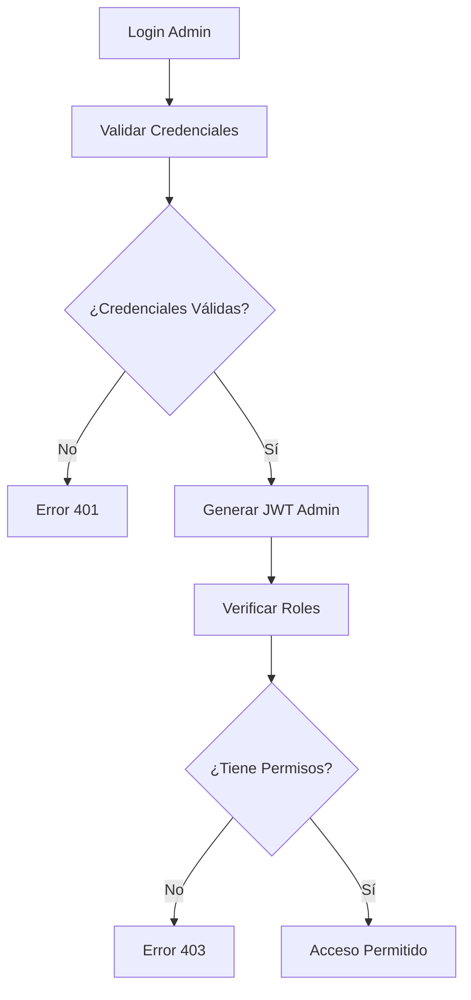

# 🏢 Sistema de Administración - MussikOn API

## 📋 Índice

- [Descripción General](#descripción-general)
- [Funcionalidades](#funcionalidades)
- [Arquitectura](#arquitectura)
- [Roles y Permisos](#roles-y-permisos)
- [Endpoints de Administración](#endpoints-de-administración)
- [Panel de Control](#panel-de-control)
- [Moderación de Contenido](#moderación-de-contenido)
- [Analytics y Reportes](#analytics-y-reportes)
- [Configuración del Sistema](#configuración-del-sistema)
- [Seguridad](#seguridad)

## 🎯 Descripción General

El Sistema de Administración de MussikOn proporciona herramientas completas para la gestión y supervisión de la plataforma. Permite a los administradores monitorear usuarios, moderar contenido, gestionar eventos, analizar métricas y configurar el sistema.

### Características Principales

- **Gestión de Usuarios**: Administración completa de perfiles y permisos
- **Moderación de Contenido**: Revisión y aprobación de contenido
- **Analytics Avanzados**: Métricas detalladas de uso y rendimiento
- **Configuración del Sistema**: Ajustes globales de la plataforma
- **Reportes Automatizados**: Generación de informes periódicos
- **Auditoría de Seguridad**: Logs de actividades administrativas

## ⚙️ Funcionalidades

### Gestión de Usuarios

#### Tipos de Usuario
- **Super Admin**: Acceso completo al sistema
- **Admin**: Gestión de usuarios y contenido
- **Moderador**: Moderación de contenido
- **Organizador**: Gestión de eventos propios
- **Músico**: Perfil de músico profesional

#### Operaciones Disponibles
- Crear, editar y eliminar usuarios
- Asignar y revocar roles
- Suspender y reactivar cuentas
- Verificar identidades
- Gestionar permisos específicos

### Moderación de Contenido

#### Contenido Moderable
- Perfiles de músicos
- Eventos y descripciones
- Comentarios y reviews
- Imágenes y multimedia
- Mensajes del chat

#### Proceso de Moderación
1. **Detección Automática**: Filtros automáticos de contenido inapropiado
2. **Revisión Manual**: Evaluación por moderadores
3. **Aprobación/Rechazo**: Decisión final con comentarios
4. **Notificación**: Comunicación al usuario sobre la decisión

### Analytics y Métricas

#### Métricas de Usuario
- Registros diarios/mensuales
- Actividad por tipo de usuario
- Retención y engagement
- Distribución geográfica

#### Métricas de Eventos
- Eventos creados vs completados
- Tasa de contratación
- Satisfacción promedio
- Ingresos generados

#### Métricas de Sistema
- Rendimiento de la API
- Uso de recursos
- Errores y excepciones
- Tiempo de respuesta

## 🏗️ Arquitectura

### Estructura de Archivos

```
src/
├── controllers/
│   ├── adminController.ts          # Controlador principal de admin
│   ├── adminAuthController.ts      # Autenticación de administradores
│   └── analyticsController.ts      # Analytics y reportes
├── services/
│   ├── adminService.ts             # Lógica de negocio administrativa
│   ├── moderationService.ts        # Servicio de moderación
│   └── analyticsService.ts         # Servicio de analytics
├── middleware/
│   ├── adminOnly.ts                # Middleware de acceso admin
│   └── requireRole.ts              # Middleware de roles
├── routes/
│   ├── adminRoutes.ts              # Rutas de administración
│   ├── adminAuthRoutes.ts          # Rutas de auth admin
│   └── analyticsRoutes.ts          # Rutas de analytics
└── types/
    └── adminTypes.ts               # Tipos específicos de admin
```

### Flujo de Autenticación



## 🔐 Roles y Permisos

### Jerarquía de Roles

```
Super Admin
├── Admin
│   ├── Moderador
│   └── Soporte
└── Analytics
```

### Permisos por Rol

#### Super Admin
- **Gestión de Administradores**: Crear, editar, eliminar otros admins
- **Configuración del Sistema**: Ajustes globales de la plataforma
- **Acceso Completo**: Todas las funcionalidades sin restricciones
- **Auditoría**: Ver logs de todas las actividades administrativas

#### Admin
- **Gestión de Usuarios**: Administrar usuarios regulares
- **Moderación**: Aprobar/rechazar contenido
- **Reportes**: Acceso a analytics y reportes
- **Configuración**: Ajustes de moderación y notificaciones

#### Moderador
- **Moderación de Contenido**: Revisar y aprobar contenido
- **Reportes de Usuarios**: Procesar reportes de contenido inapropiado
- **Comunicación**: Enviar mensajes a usuarios

#### Analytics
- **Lectura de Métricas**: Acceso a reportes y analytics
- **Exportación**: Descargar reportes en diferentes formatos
- **Dashboards**: Visualización de métricas en tiempo real

### Implementación de Permisos

```typescript
// middleware/requireRole.ts
export const requireRole = (roles: string[]) => {
  return (req: Request, res: Response, next: NextFunction) => {
    const userRole = req.user?.role;
    
    if (!userRole || !roles.includes(userRole)) {
      return res.status(403).json({ 
        error: 'No tienes permisos para acceder a este recurso' 
      });
    }
    
    next();
  };
};

// Uso en rutas
router.get('/users', 
  authMiddleware, 
  requireRole(['admin', 'super_admin']), 
  adminController.getAllUsers
);
```

## 🔌 Endpoints de Administración

### Autenticación de Administradores

#### POST `/api/admin/auth/login`
```typescript
// Request
{
  "email": "admin@mussikon.com",
  "password": "password123"
}

// Response
{
  "success": true,
  "token": "jwt_token_here",
  "admin": {
    "id": "admin_123",
    "email": "admin@mussikon.com",
    "role": "admin",
    "permissions": ["users", "moderation", "analytics"]
  }
}
```

#### POST `/api/admin/auth/logout`
```typescript
// Response
{
  "success": true,
  "message": "Sesión cerrada exitosamente"
}
```

### Gestión de Usuarios

#### GET `/api/admin/users`
```typescript
// Query Parameters
{
  "page": 1,
  "limit": 20,
  "role": "musician",
  "status": "active",
  "search": "john"
}

// Response
{
  "users": [
    {
      "id": "user_123",
      "email": "john@example.com",
      "name": "John Doe",
      "role": "musician",
      "status": "active",
      "createdAt": "2024-01-15T10:30:00Z",
      "lastLogin": "2024-12-19T08:45:00Z"
    }
  ],
  "pagination": {
    "page": 1,
    "limit": 20,
    "total": 150,
    "pages": 8
  }
}
```

#### PUT `/api/admin/users/:id/role`
```typescript
// Request
{
  "role": "moderator",
  "reason": "Promoción por buen desempeño"
}

// Response
{
  "success": true,
  "message": "Rol actualizado exitosamente",
  "user": {
    "id": "user_123",
    "role": "moderator",
    "updatedAt": "2024-12-19T10:30:00Z"
  }
}
```

#### PUT `/api/admin/users/:id/status`
```typescript
// Request
{
  "status": "suspended",
  "reason": "Violación de términos de servicio",
  "duration": "7d" // 7 días
}

// Response
{
  "success": true,
  "message": "Usuario suspendido exitosamente",
  "suspension": {
    "startDate": "2024-12-19T10:30:00Z",
    "endDate": "2024-12-26T10:30:00Z",
    "reason": "Violación de términos de servicio"
  }
}
```

### Moderación de Contenido

#### GET `/api/admin/moderation/pending`
```typescript
// Response
{
  "pendingItems": [
    {
      "id": "content_123",
      "type": "musician_profile",
      "userId": "user_456",
      "content": "Perfil de músico",
      "submittedAt": "2024-12-19T09:00:00Z",
      "priority": "high"
    }
  ],
  "stats": {
    "total": 25,
    "highPriority": 5,
    "mediumPriority": 15,
    "lowPriority": 5
  }
}
```

#### POST `/api/admin/moderation/:id/review`
```typescript
// Request
{
  "action": "approve", // "approve" | "reject"
  "comment": "Contenido apropiado y cumple con las políticas",
  "notifyUser": true
}

// Response
{
  "success": true,
  "message": "Contenido aprobado exitosamente",
  "review": {
    "id": "review_123",
    "moderatorId": "admin_456",
    "action": "approve",
    "timestamp": "2024-12-19T10:30:00Z"
  }
}
```

### Analytics y Reportes

#### GET `/api/admin/analytics/overview`
```typescript
// Response
{
  "period": "last_30_days",
  "users": {
    "total": 15420,
    "new": 1234,
    "active": 8920,
    "growth": 8.5
  },
  "events": {
    "total": 567,
    "completed": 489,
    "cancelled": 78,
    "successRate": 86.2
  },
  "revenue": {
    "total": 125000,
    "average": 256,
    "growth": 12.3
  },
  "engagement": {
    "avgSessionDuration": 15.5,
    "bounceRate": 23.4,
    "retentionRate": 67.8
  }
}
```

#### GET `/api/admin/analytics/users`
```typescript
// Query Parameters
{
  "period": "last_7_days",
  "groupBy": "day", // "day" | "week" | "month"
  "filters": {
    "role": "musician",
    "status": "active"
  }
}

// Response
{
  "data": [
    {
      "date": "2024-12-13",
      "newUsers": 45,
      "activeUsers": 234,
      "totalUsers": 15420
    }
  ],
  "summary": {
    "totalNew": 315,
    "totalActive": 1638,
    "growthRate": 8.5
  }
}
```

#### POST `/api/admin/analytics/export`
```typescript
// Request
{
  "reportType": "user_activity",
  "period": "last_30_days",
  "format": "csv", // "csv" | "xlsx" | "pdf"
  "filters": {
    "role": "musician"
  }
}

// Response
{
  "success": true,
  "downloadUrl": "https://api.mussikon.com/exports/report_123.csv",
  "expiresAt": "2024-12-20T10:30:00Z"
}
```

## 📊 Panel de Control

### Dashboard Principal

El panel de control proporciona una vista general de la plataforma con:

#### Widgets Principales
- **Usuarios Activos**: Contador en tiempo real
- **Eventos Hoy**: Eventos programados para hoy
- **Ingresos del Mes**: Métricas financieras
- **Alertas**: Notificaciones importantes

#### Gráficos Interactivos
- **Crecimiento de Usuarios**: Gráfico de líneas
- **Distribución de Roles**: Gráfico de dona
- **Actividad por Hora**: Gráfico de barras
- **Mapa de Usuarios**: Distribución geográfica

### Navegación

```
Dashboard
├── Usuarios
│   ├── Lista de Usuarios
│   ├── Gestión de Roles
│   └── Reportes de Usuarios
├── Moderación
│   ├── Contenido Pendiente
│   ├── Historial de Moderación
│   └── Configuración de Filtros
├── Analytics
│   ├── Métricas Generales
│   ├── Reportes Personalizados
│   └── Exportación de Datos
├── Configuración
│   ├── Configuración del Sistema
│   ├── Gestión de Administradores
│   └── Logs de Auditoría
└── Soporte
    ├── Tickets de Soporte
    ├── FAQ Management
    └── Comunicaciones
```

## 🛡️ Moderación de Contenido

### Sistema de Filtros

#### Filtros Automáticos
- **Palabras Prohibidas**: Lista de términos inapropiados
- **Spam Detection**: Detección de contenido spam
- **Imagen Analysis**: Análisis de imágenes inapropiadas
- **Rate Limiting**: Límites de publicación

#### Configuración de Filtros
```typescript
// Configuración de filtros automáticos
const filterConfig = {
  profanity: {
    enabled: true,
    sensitivity: 'medium',
    languages: ['es', 'en']
  },
  spam: {
    enabled: true,
    maxPostsPerHour: 5,
    duplicateThreshold: 0.8
  },
  images: {
    enabled: true,
    maxSize: 5 * 1024 * 1024, // 5MB
    allowedFormats: ['jpg', 'png', 'webp']
  }
};
```

### Proceso de Revisión

1. **Detección**: Sistema automático identifica contenido sospechoso
2. **Clasificación**: Se asigna prioridad (alta, media, baja)
3. **Asignación**: Se asigna a un moderador disponible
4. **Revisión**: Moderador evalúa el contenido
5. **Decisión**: Aprobación o rechazo con comentarios
6. **Notificación**: Se informa al usuario sobre la decisión
7. **Seguimiento**: Se registra la acción para auditoría

### Herramientas de Moderación

#### Vista de Moderación
- **Lista de Pendientes**: Contenido esperando revisión
- **Filtros Avanzados**: Búsqueda por tipo, usuario, fecha
- **Acciones Rápidas**: Botones para aprobar/rechazar
- **Historial**: Ver decisiones anteriores

#### Comunicación con Usuarios
- **Plantillas de Respuesta**: Respuestas predefinidas
- **Notificaciones Automáticas**: Informes automáticos
- **Seguimiento**: Historial de comunicaciones

## 📈 Analytics y Reportes

### Métricas en Tiempo Real

#### Dashboard de Métricas
- **Usuarios Online**: Contador en tiempo real
- **Eventos Activos**: Eventos en curso
- **Transacciones**: Pagos procesados
- **Errores**: Excepciones del sistema

#### Alertas Automáticas
- **Picos de Tráfico**: Notificaciones de alto tráfico
- **Errores Críticos**: Alertas de errores importantes
- **Suspicacia**: Actividad sospechosa detectada

### Reportes Programados

#### Reportes Diarios
- Resumen de actividad del día
- Nuevos usuarios registrados
- Eventos creados y completados
- Métricas de engagement

#### Reportes Semanales
- Análisis de tendencias
- Comparación con semanas anteriores
- Predicciones de crecimiento
- Recomendaciones de optimización

#### Reportes Mensuales
- Análisis completo del mes
- Métricas financieras detalladas
- Análisis de retención
- Planificación estratégica

### Exportación de Datos

#### Formatos Soportados
- **CSV**: Para análisis en Excel
- **JSON**: Para integración con otras herramientas
- **PDF**: Para reportes formales
- **XLSX**: Para análisis avanzado

#### Configuración de Exportación
```typescript
// Configuración de exportación
const exportConfig = {
  csv: {
    delimiter: ',',
    encoding: 'utf-8',
    includeHeaders: true
  },
  pdf: {
    orientation: 'portrait',
    format: 'A4',
    includeCharts: true
  },
  xlsx: {
    includeFormulas: false,
    autoFilter: true,
    freezePanes: true
  }
};
```

## ⚙️ Configuración del Sistema

### Configuración General

#### Configuración de la Plataforma
```typescript
// Configuración global del sistema
const systemConfig = {
  platform: {
    name: 'MussikOn',
    version: '1.0.0',
    maintenance: false,
    maintenanceMessage: ''
  },
  features: {
    chat: true,
    payments: true,
    notifications: true,
    analytics: true
  },
  limits: {
    maxFileSize: 10 * 1024 * 1024, // 10MB
    maxUsersPerEvent: 1000,
    maxEventsPerUser: 50
  }
};
```

#### Configuración de Notificaciones
```typescript
// Configuración de notificaciones
const notificationConfig = {
  email: {
    enabled: true,
    provider: 'smtp',
    templates: {
      welcome: 'welcome-email.html',
      eventReminder: 'event-reminder.html',
      paymentConfirmation: 'payment-confirmation.html'
    }
  },
  push: {
    enabled: true,
    provider: 'expo',
    categories: ['events', 'payments', 'chat', 'system']
  },
  sms: {
    enabled: false,
    provider: 'twilio'
  }
};
```

### Gestión de Administradores

#### Crear Nuevo Administrador
```typescript
// POST /api/admin/administrators
{
  "email": "newadmin@mussikon.com",
  "password": "securePassword123",
  "role": "admin",
  "permissions": ["users", "moderation", "analytics"],
  "firstName": "John",
  "lastName": "Doe"
}
```

#### Gestionar Permisos
```typescript
// PUT /api/admin/administrators/:id/permissions
{
  "permissions": {
    "users": {
      "read": true,
      "write": true,
      "delete": false
    },
    "moderation": {
      "read": true,
      "write": true,
      "delete": true
    },
    "analytics": {
      "read": true,
      "write": false,
      "delete": false
    }
  }
}
```

## 🔒 Seguridad

### Autenticación de Administradores

#### Doble Factor de Autenticación
- **TOTP**: Códigos de tiempo limitado
- **SMS**: Códigos enviados por SMS
- **Email**: Códigos enviados por email

#### Configuración de Seguridad
```typescript
// Configuración de seguridad
const securityConfig = {
  authentication: {
    mfa: {
      enabled: true,
      methods: ['totp', 'sms'],
      required: true
    },
    session: {
      timeout: 3600, // 1 hora
      maxConcurrent: 3
    },
    password: {
      minLength: 12,
      requireSpecialChars: true,
      requireNumbers: true,
      requireUppercase: true
    }
  },
  audit: {
    enabled: true,
    logLevel: 'info',
    retention: '90d'
  }
};
```

### Auditoría de Actividades

#### Logs de Auditoría
- **Login/Logout**: Registro de sesiones
- **Acciones Administrativas**: Todas las acciones realizadas
- **Cambios de Configuración**: Modificaciones al sistema
- **Acceso a Datos Sensibles**: Consultas a información privada

#### Formato de Logs
```typescript
// Formato de log de auditoría
interface AuditLog {
  id: string;
  timestamp: Date;
  adminId: string;
  action: string;
  resource: string;
  resourceId?: string;
  details: any;
  ipAddress: string;
  userAgent: string;
  success: boolean;
  errorMessage?: string;
}
```

### Protección de Datos

#### Encriptación
- **Datos en Tránsito**: HTTPS/TLS obligatorio
- **Datos en Reposo**: Encriptación AES-256
- **Contraseñas**: Hash bcrypt con salt
- **Tokens**: JWT firmados con clave secreta

#### Acceso a Datos
- **Principio de Mínimo Privilegio**: Solo acceso necesario
- **Logs de Acceso**: Registro de todas las consultas
- **Anonimización**: Datos sensibles anonimizados en reportes
- **Retención**: Políticas de retención de datos

## 🚀 Próximas Funcionalidades

### En Desarrollo
- **Machine Learning**: Detección automática de contenido inapropiado
- **Chatbot de Soporte**: Asistente automático para usuarios
- **Integración con CRM**: Gestión avanzada de relaciones con clientes
- **API de Administración**: API pública para integraciones

### Planificadas
- **Análisis Predictivo**: Predicciones de comportamiento de usuarios
- **Automatización**: Flujos de trabajo automatizados
- **Integración con Redes Sociales**: Moderación de contenido social
- **Sistema de Recompensas**: Programa de fidelización

---

**Anterior**: [Guía de Desarrollo](../development/README.md)  
**Siguiente**: [Sistema de Pagos](../payment-system/README.md) 