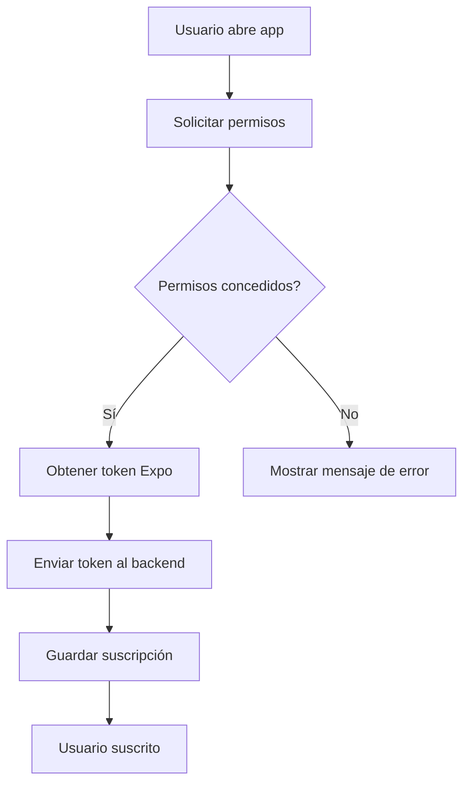
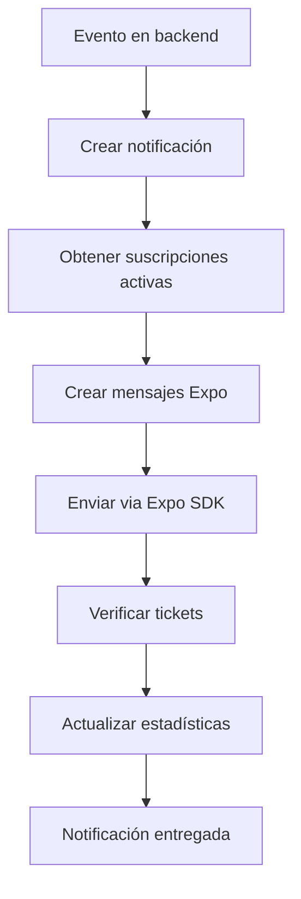
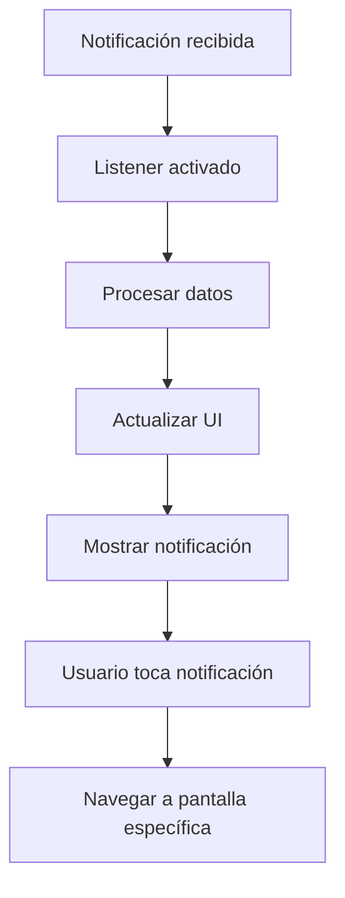

# 🔔 Sistema de Notificaciones Push - Integración Completa

## 📋 Resumen

Este documento describe la implementación completa del sistema de notificaciones push para la aplicación MussikOn, integrando tanto el backend (Node.js/Express) como la app móvil (React Native/Expo).

## 🏗️ Arquitectura del Sistema

### **Backend (Node.js/Express)**
- **Servicio**: `src/services/pushNotificationService.ts`
- **Controlador**: `src/controllers/pushNotificationController.ts`
- **Rutas**: `src/routes/pushNotificationRoutes.ts`
- **SDK**: Expo Server SDK para envío de notificaciones

### **App Móvil (React Native/Expo)**
- **Servicio**: `src/services/pushNotificationService.ts`
- **Hook**: `src/hooks/usePushNotifications.ts`
- **Componente**: `src/components/features/PushNotificationsManager.tsx`
- **Pantalla**: `src/screens/notifications/PushNotificationsScreen.tsx`
- **SDK**: Expo Notifications para recepción de notificaciones

## 🚀 Configuración Inicial

### **1. Backend - Variables de Entorno**

Agregar al archivo `.env`:

```bash
# Expo Push Notifications
EXPO_ACCESS_TOKEN=your-expo-access-token
EXPO_PROJECT_ID=your-expo-project-id

# VAPID Keys (para Web Push)
VAPID_PUBLIC_KEY=your-vapid-public-key
VAPID_PRIVATE_KEY=your-vapid-private-key
```

### **2. App Móvil - Dependencias**

```bash
npm install expo-notifications expo-device expo-constants
```

### **3. Configuración de Expo**

En `app.json` de la app móvil:

```json
{
  "expo": {
    "name": "MussikOn",
    "slug": "mussikon-app",
    "version": "1.0.0",
    "platforms": ["ios", "android"],
    "notification": {
      "icon": "./assets/notification-icon.png",
      "color": "#000000",
      "iosDisplayInForeground": true
    },
    "extra": {
      "eas": {
        "projectId": "your-expo-project-id"
      }
    }
  }
}
```

## 📱 Funcionalidades Implementadas

### **App Móvil**

#### **1. Inicialización Automática**
```typescript
// Se inicializa automáticamente cuando hay usuario autenticado
const { initialize, isInitialized } = usePushNotifications();

useEffect(() => {
  if (user?.id && !isInitialized) {
    initialize();
  }
}, [user?.id, isInitialized]);
```

#### **2. Gestión de Permisos**
- Solicitud automática de permisos
- Verificación del estado de permisos
- Manejo de permisos denegados

#### **3. Suscripción/Desuscripción**
```typescript
const { subscribe, unsubscribe } = usePushNotifications();

// Suscribirse
await subscribe();

// Desuscribirse
await unsubscribe(subscriptionId);
```

#### **4. Configuración Granular**
- Habilitar/deshabilitar notificaciones
- Categorías de notificaciones (system, user, event, request, payment, chat)
- Horas silenciosas configurables
- Sonido y vibración

#### **5. UI Completa**
- **4 Pestañas**: Estado, Suscripciones, Configuración, Estadísticas
- **Gestión visual** de suscripciones activas
- **Configuración intuitiva** con switches
- **Estadísticas en tiempo real**

### **Backend**

#### **1. Envío de Notificaciones**
```typescript
// Notificación individual
await pushNotificationService.sendNotificationToUser(userId, {
  title: 'Nueva solicitud',
  body: 'Tienes una nueva solicitud de evento',
  category: 'request',
  type: 'new_request',
  data: { eventId: '123' }
});

// Notificación masiva
await pushNotificationService.sendBulkNotification({
  userIds: ['user1', 'user2', 'user3'],
  title: 'Mantenimiento programado',
  body: 'El sistema estará en mantenimiento mañana',
  category: 'system'
});
```

#### **2. Gestión de Suscripciones**
- Almacenamiento de tokens Expo
- Verificación de suscripciones activas
- Limpieza automática de suscripciones inválidas

#### **3. Templates de Notificaciones**
```typescript
// Crear template
await pushNotificationService.createNotificationTemplate({
  name: 'Nueva Solicitud',
  title: '🎵 Nueva Solicitud de Evento',
  body: 'Tienes una nueva solicitud para tocar en un evento',
  category: 'request',
  type: 'new_request',
  isActive: true
});
```

#### **4. Estadísticas y Monitoreo**
- Tasa de entrega de notificaciones
- Errores y fallos
- Métricas de rendimiento

## 🔧 API Endpoints

### **Suscripciones**
```bash
POST   /api/push-notifications/subscriptions     # Crear suscripción
GET    /api/push-notifications/subscriptions     # Obtener suscripciones
DELETE /api/push-notifications/subscription/:id  # Eliminar suscripción
```

### **Configuración**
```bash
GET    /api/push-notifications/settings          # Obtener configuración
PUT    /api/push-notifications/settings          # Actualizar configuración
```

### **Envío**
```bash
POST   /api/push-notifications/send/:userId      # Enviar a usuario específico
POST   /api/push-notifications/bulk              # Envío masivo
POST   /api/push-notifications/test              # Notificación de prueba
```

### **Templates**
```bash
POST   /api/push-notifications/templates         # Crear template
GET    /api/push-notifications/templates         # Obtener templates
PUT    /api/push-notifications/templates/:id     # Actualizar template
DELETE /api/push-notifications/templates/:id     # Eliminar template
```

### **Estadísticas**
```bash
GET    /api/push-notifications/stats             # Obtener estadísticas
```

## 📊 Flujo de Notificaciones

### **1. Suscripción del Usuario**


### **2. Envío de Notificación**


### **3. Recepción en App**


## 🛠️ Casos de Uso Implementados

### **1. Nuevas Solicitudes de Eventos**
```typescript
// Cuando se crea una nueva solicitud
await pushNotificationService.sendNotificationToUser(musicianId, {
  title: '🎵 Nueva Solicitud Disponible',
  body: `Evento: ${eventName} - ${instrument} - $${budget}`,
  category: 'request',
  type: 'new_request',
  data: { 
    eventId: event.id,
    screen: 'EventDetails',
    params: { eventId: event.id }
  }
});
```

### **2. Aceptación de Solicitudes**
```typescript
// Cuando un músico acepta una solicitud
await pushNotificationService.sendNotificationToUser(organizerId, {
  title: '✅ Músico Aceptó tu Solicitud',
  body: `${musicianName} ha aceptado tocar en ${eventName}`,
  category: 'request',
  type: 'request_accepted',
  data: { 
    eventId: event.id,
    musicianId: musician.id,
    screen: 'EventDetails'
  }
});
```

### **3. Recordatorios de Eventos**
```typescript
// Recordatorio 24h antes del evento
await pushNotificationService.sendBulkNotification({
  userIds: eventParticipants,
  title: '⏰ Recordatorio de Evento',
  body: `Mañana tienes el evento: ${eventName}`,
  category: 'event',
  type: 'event_reminder',
  data: { 
    eventId: event.id,
    screen: 'EventDetails'
  }
});
```

### **4. Mensajes de Chat**
```typescript
// Nuevo mensaje en chat
await pushNotificationService.sendNotificationToUser(recipientId, {
  title: `💬 ${senderName}`,
  body: messagePreview,
  category: 'chat',
  type: 'new_message',
  data: { 
    chatId: chat.id,
    screen: 'ChatScreen',
    params: { chatId: chat.id }
  }
});
```

## 🔍 Monitoreo y Debugging

### **Logs del Backend**
```typescript
// Logs automáticos en el servicio
console.log('✅ Notificación enviada exitosamente', {
  userId,
  title: notification.title,
  ticketsSent: tickets.length,
  errors: receiptIds.length
});
```

### **Logs de la App Móvil**
```typescript
// Logs en el hook
console.log('📱 Notificación recibida:', notification);
console.log('📱 Respuesta a notificación:', response);
```

### **Estadísticas en Tiempo Real**
- Total de notificaciones enviadas
- Tasa de entrega exitosa
- Errores y fallos
- Tiempo promedio de entrega

## 🚨 Manejo de Errores

### **Backend**
```typescript
try {
  const result = await pushNotificationService.sendNotificationToUser(userId, notification);
  if (!result) {
    logger.error('Error enviando notificación', { userId, error: 'Service failed' });
  }
} catch (error) {
  logger.error('Error enviando notificación', { userId, error: error.message });
}
```

### **App Móvil**
```typescript
try {
  const success = await subscribe();
  if (!success) {
    Alert.alert('Error', 'No se pudo suscribir a las notificaciones');
  }
} catch (error) {
  console.error('❌ Error suscribiéndose:', error);
  Alert.alert('Error', 'Error suscribiéndose a notificaciones');
}
```

## 🔒 Seguridad

### **Validación de Tokens**
- Verificación de tokens Expo válidos
- Limpieza automática de tokens expirados
- Validación de permisos por usuario

### **Rate Limiting**
- Límite de notificaciones por usuario
- Protección contra spam
- Monitoreo de abuso

### **Datos Sensibles**
- Encriptación de tokens en base de datos
- Validación de datos de entrada
- Sanitización de contenido

## 📈 Optimizaciones

### **1. Chunking de Notificaciones**
```typescript
// Expo SDK maneja automáticamente el chunking
const chunks = expo.chunkPushNotifications(messages);
for (const chunk of chunks) {
  await expo.sendPushNotificationsAsync(chunk);
}
```

### **2. Verificación de Receipts**
```typescript
// Verificar errores de entrega
const receiptIds = tickets
  .filter(ticket => ticket.status === 'error')
  .map(ticket => ticket.id);

if (receiptIds.length > 0) {
  const receipts = await expo.getPushNotificationReceiptsAsync(receiptIds);
  // Procesar errores
}
```

### **3. Cache de Configuración**
- Cache de configuración de usuarios
- Reducción de consultas a base de datos
- Respuesta más rápida

## 🧪 Testing

### **Notificación de Prueba**
```typescript
// En la app móvil
const { testNotification } = usePushNotifications();
await testNotification();

// En el backend
await pushNotificationService.testPushNotification();
```

### **Verificación de Estado**
```typescript
// Verificar estado del servicio
const { isInitialized, isSubscribed, permission } = usePushNotifications();

console.log('Estado del servicio:', {
  isInitialized,
  isSubscribed,
  permission: permission.granted
});
```

## 📚 Recursos Adicionales

### **Documentación Oficial**
- [Expo Notifications](https://docs.expo.dev/versions/latest/sdk/notifications/)
- [Expo Server SDK](https://docs.expo.dev/push-notifications/sending-notifications/)
- [React Native Push Notifications](https://github.com/zo0r/react-native-push-notification)

### **Herramientas de Testing**
- [Expo Push Tool](https://expo.dev/notifications)
- [Firebase Console](https://console.firebase.google.com/)
- [Postman Collection](docs/postman/PushNotifications.postman_collection.json)

### **Monitoreo**
- [Expo Analytics](https://docs.expo.dev/analytics/)
- [Firebase Analytics](https://firebase.google.com/docs/analytics)
- [Custom Dashboard](docs/dashboard/README.md)

## 🎯 Próximos Pasos

### **Fase 2 - Mejoras**
- [ ] Notificaciones programadas
- [ ] Notificaciones con imágenes
- [ ] Notificaciones interactivas
- [ ] A/B testing de notificaciones
- [ ] Analytics avanzados

### **Fase 3 - Escalabilidad**
- [ ] Queue de notificaciones (Redis/Bull)
- [ ] Microservicio de notificaciones
- [ ] CDN para assets de notificaciones
- [ ] Load balancing para envío masivo

### **Fase 4 - Integración Avanzada**
- [ ] Notificaciones de email + push
- [ ] Notificaciones SMS
- [ ] Integración con calendario
- [ ] Notificaciones de pago

---

**✅ Sistema de Notificaciones Push - Implementación Completa**

El sistema está listo para producción con todas las funcionalidades básicas implementadas y documentadas. 