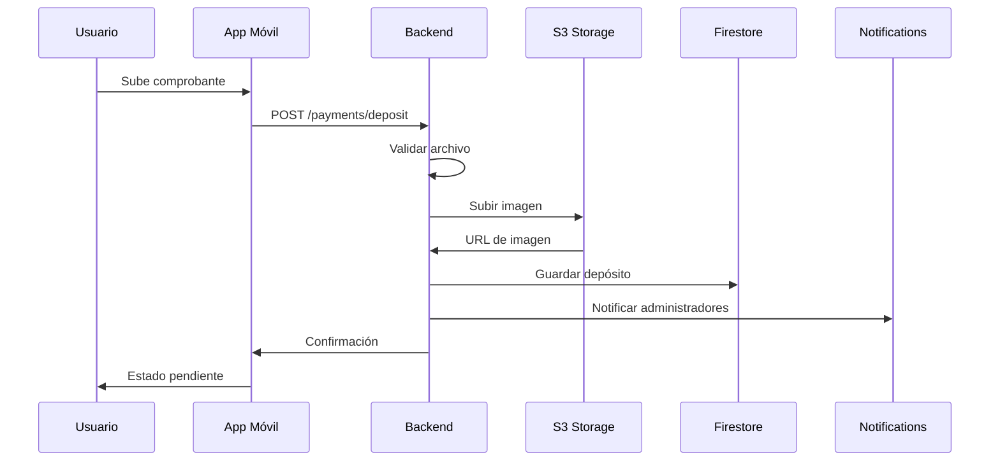
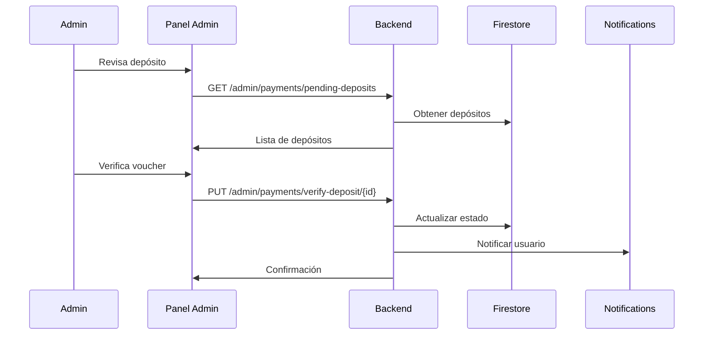
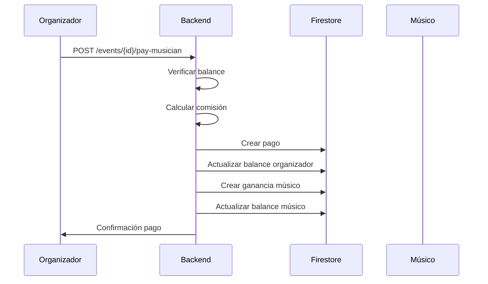

# Sistema de Pagos de Mussikon - Documentación Completa

## 📋 Índice

1. [Descripción General](#descripción-general)
2. [Arquitectura del Sistema](#arquitectura-del-sistema)
3. [Componentes Principales](#componentes-principales)
4. [Flujo de Trabajo](#flujo-de-trabajo)
5. [API Endpoints](#api-endpoints)
6. [Manejo de Imágenes](#manejo-de-imágenes)
7. [Seguridad y Validaciones](#seguridad-y-validaciones)
8. [Notificaciones](#notificaciones)
9. [Administración](#administración)
10. [Troubleshooting](#troubleshooting)

---

## 🎯 Descripción General

El Sistema de Pagos de Mussikon es una plataforma integral que permite a los usuarios realizar depósitos bancarios, gestionar sus balances y procesar pagos de eventos de manera segura y confiable. El sistema incluye:

- **Subida de comprobantes de depósito** con validación de imágenes
- **Verificación administrativa** de depósitos
- **Gestión de balances** de usuarios
- **Pagos de eventos** con comisiones automáticas
- **Solicitudes de retiro** para músicos
- **Notificaciones en tiempo real**
- **Panel de administración** completo

---

## 🏗️ Arquitectura del Sistema

### Componentes Principales

```
┌─────────────────┐    ┌─────────────────┐    ┌─────────────────┐
│   App Móvil     │    │   Backend       │    │   Admin System  │
│   (React Native)│◄──►│   (Express)     │◄──►│   (Web Panel)   │
└─────────────────┘    └─────────────────┘    └─────────────────┘
         │                       │                       │
         │                       │                       │
         ▼                       ▼                       ▼
┌─────────────────┐    ┌─────────────────┐    ┌─────────────────┐
│   Upload        │    │   Payment       │    │   Verification  │
│   Voucher       │    │   Processing    │    │   Dashboard     │
└─────────────────┘    └─────────────────┘    └─────────────────┘
```

### Stack Tecnológico

- **Backend:** Node.js + Express + TypeScript
- **Base de datos:** Firebase Firestore
- **Almacenamiento:** AWS S3 (idriveE2)
- **Autenticación:** JWT
- **Notificaciones:** Socket.IO + Push Notifications
- **Validación:** Joi + Multer

---

## 🔧 Componentes Principales

### 1. PaymentSystemService

Servicio principal que maneja toda la lógica de pagos:

```typescript
export class PaymentSystemService {
  // Validaciones
  private validateDepositAmount(amount: number): void
  private validateVoucherFile(file: Express.Multer.File): void
  
  // Operaciones principales
  async uploadDepositVoucher(userId: string, depositData: DepositRequest): Promise<UserDeposit>
  async verifyDeposit(depositId: string, adminId: string, approved: boolean): Promise<void>
  async processEventPayment(paymentData: EventPaymentRequest): Promise<EventPayment>
  async requestWithdrawal(musicianId: string, withdrawalData: WithdrawalRequestData): Promise<WithdrawalRequest>
}
```

### 2. ImageService

Servicio mejorado para el manejo de imágenes:

```typescript
export class ImageService {
  // Validaciones
  validateImageFile(file: Express.Multer.File): ImageValidationResult
  
  // Operaciones
  async uploadImage(file: Express.Multer.File, userId: string, folder: string): Promise<ImageUploadResult>
  async getImage(imageId: string): Promise<ImageUploadResult | null>
  async verifyImageIntegrity(imageId: string): Promise<ImageIntegrityResult>
}
```

### 3. PaymentSystemController

Controlador que maneja las peticiones HTTP:

```typescript
export class PaymentSystemController {
  // Endpoints de usuario
  async uploadDepositVoucher(req: Request, res: Response): Promise<void>
  async getUserBalance(req: Request, res: Response): Promise<void>
  async getUserDeposits(req: Request, res: Response): Promise<void>
  
  // Endpoints de administración
  async getPendingDeposits(req: Request, res: Response): Promise<void>
  async verifyDeposit(req: Request, res: Response): Promise<void>
  async getPaymentStatistics(req: Request, res: Response): Promise<void>
}
```

---

## 🔄 Flujo de Trabajo

### 1. Subida de Comprobante de Depósito



### 2. Verificación de Depósito



### 3. Pago de Evento



---

## 📡 API Endpoints

### Endpoints de Usuario

#### Obtener Balance
```http
GET /payments/my-balance
Authorization: Bearer <token>
```

#### Subir Comprobante de Depósito
```http
POST /payments/deposit
Authorization: Bearer <token>
Content-Type: multipart/form-data

{
  "amount": 1000,
  "voucherFile": <file>,
  "accountHolderName": "Juan Pérez",
  "bankName": "Banco Popular",
  "depositDate": "2024-01-15",
  "depositTime": "14:30",
  "referenceNumber": "REF123456",
  "comments": "Pago por suscripción Premium"
}
```

#### Obtener Depósitos del Usuario
```http
GET /payments/my-deposits
Authorization: Bearer <token>
```

#### Registrar Cuenta Bancaria
```http
POST /bank-accounts/register
Authorization: Bearer <token>

{
  "accountHolder": "Juan Pérez",
  "accountNumber": "1234567890",
  "bankName": "Banco Popular",
  "accountType": "savings",
  "routingNumber": "123456789"
}
```

#### Solicitar Retiro
```http
POST /musicians/withdraw-earnings
Authorization: Bearer <token>

{
  "amount": 500,
  "bankAccountId": "bank_1234567890"
}
```

### Endpoints de Administración

#### Obtener Depósitos Pendientes
```http
GET /admin/payments/pending-deposits
Authorization: Bearer <token>
```

#### Verificar Depósito
```http
PUT /admin/payments/verify-deposit/{depositId}
Authorization: Bearer <token>

{
  "approved": true,
  "notes": "Depósito verificado correctamente",
  "verificationData": {
    "bankDepositDate": "2024-01-15",
    "bankDepositTime": "14:30",
    "referenceNumber": "REF123456",
    "accountLastFourDigits": "7890"
  }
}
```

#### Obtener Imagen del Voucher
```http
GET /admin/payments/voucher-image/{depositId}
Authorization: Bearer <token>
```

#### Obtener Estadísticas
```http
GET /admin/payments/statistics
Authorization: Bearer <token>
```

---

## 🖼️ Manejo de Imágenes

### Validaciones de Archivo

```typescript
// Tipos permitidos
const ALLOWED_MIME_TYPES = [
  'image/jpeg',
  'image/png', 
  'image/gif',
  'image/webp',
  'application/pdf'
];

// Tamaño máximo: 10MB
const MAX_FILE_SIZE = 10 * 1024 * 1024;
```

### Estructura de Almacenamiento

```
deposits/
├── user123/
│   ├── 1705123456789_abc123_voucher.jpg
│   └── 1705123456790_def456_receipt.png
└── user456/
    └── 1705123456791_ghi789_payment.pdf
```

### Endpoints de Imágenes

#### Subir Imagen
```http
POST /images/upload
Authorization: Bearer <token>
Content-Type: multipart/form-data

{
  "file": <image_file>,
  "folder": "deposits",
  "description": "Comprobante de depósito",
  "tags": "payment,voucher,deposit"
}
```

#### Servir Imagen
```http
GET /images/{imageId}/serve
```

#### Verificar Integridad
```http
GET /images/{imageId}/integrity
```

---

## 🔒 Seguridad y Validaciones

### Validaciones de Depósito

```typescript
// Montos
const MIN_DEPOSIT_AMOUNT = 100; // RD$ 100
const MAX_DEPOSIT_AMOUNT = 1000000; // RD$ 1,000,000

// Validaciones
- Monto mínimo y máximo
- Tipo de archivo permitido
- Tamaño de archivo (máximo 10MB)
- Datos obligatorios (nombre titular, banco)
- Detección de duplicados
```

### Validaciones de Retiro

```typescript
const MIN_WITHDRAWAL_AMOUNT = 500; // RD$ 500

// Validaciones
- Saldo suficiente
- Cuenta bancaria válida
- Monto mínimo de retiro
```

### Detección de Fraude

```typescript
// Verificaciones automáticas
- Detección de vouchers duplicados
- Validación de montos razonables
- Verificación de datos bancarios
- Tracking de intentos de fraude
```

---

## 📱 Notificaciones

### Tipos de Notificación

```typescript
// Para usuarios
- Depósito aprobado/rechazado
- Balance actualizado
- Retiro procesado

// Para administradores
- Nuevo depósito pendiente
- Retiro solicitado
- Estadísticas actualizadas
```

### Implementación

```typescript
// Notificación en tiempo real
await db.collection('notifications').add({
  userId: userId,
  title: 'Depósito Aprobado',
  message: `Tu depósito de RD$ ${amount} ha sido aprobado`,
  type: 'success',
  category: 'payment',
  isRead: false,
  createdAt: new Date()
});

// Push notification
await pushNotificationService.sendNotificationToUser(userId, {
  title: 'Depósito Aprobado',
  body: `Tu depósito ha sido aprobado`,
  data: { depositId, type: 'deposit_approved' }
});
```

---

## 👨‍💼 Administración

### Panel de Administración

#### Funcionalidades Principales

1. **Gestión de Depósitos**
   - Ver depósitos pendientes
   - Verificar vouchers
   - Aprobar/rechazar depósitos
   - Ver historial completo

2. **Gestión de Retiros**
   - Ver solicitudes pendientes
   - Procesar retiros
   - Ver historial de retiros

3. **Estadísticas**
   - Total de depósitos
   - Total de pagos
   - Comisiones generadas
   - Usuarios activos

4. **Gestión de Imágenes**
   - Verificar integridad
   - Limpiar archivos no utilizados
   - Estadísticas de almacenamiento

#### Endpoints de Administración

```typescript
// Depósitos
GET /admin/payments/pending-deposits
PUT /admin/payments/verify-deposit/{id}
GET /admin/payments/voucher-image/{id}

// Retiros
GET /admin/payments/pending-withdrawals
PUT /admin/payments/process-withdrawal/{id}

// Estadísticas
GET /admin/payments/statistics

// Imágenes
GET /images/statistics
POST /images/cleanup
GET /images/{id}/integrity
```

---

## 🔧 Troubleshooting

### Problemas Comunes

#### 1. Error al subir imagen
```typescript
// Causas posibles
- Archivo demasiado grande (>10MB)
- Tipo de archivo no permitido
- Error de conexión con S3
- Problemas de red

// Soluciones
- Validar archivo antes de subir
- Comprimir imagen si es necesario
- Reintentar en caso de error de red
- Verificar configuración de S3
```

#### 2. Imagen no se muestra
```typescript
// Causas posibles
- URL expirada
- Archivo eliminado de S3
- Problemas de permisos
- Error en la base de datos

// Soluciones
- Verificar integridad de imagen
- Regenerar URL si es necesario
- Verificar permisos de S3
- Restaurar desde backup si es necesario
```

#### 3. Depósito no aparece en panel admin
```typescript
// Causas posibles
- Error en notificación
- Problema de permisos
- Error en consulta de base de datos
- Índices de Firestore faltantes

// Soluciones
- Verificar logs de notificación
- Verificar permisos de usuario
- Verificar índices de Firestore
- Revisar consultas de base de datos
```

### Logs y Monitoreo

```typescript
// Logs importantes
logger.info('Depósito creado', { depositId, userId, amount });
logger.error('Error subiendo imagen', error, { userId });
logger.warn('Posible duplicado detectado', { userId, amount });

// Métricas a monitorear
- Tiempo de respuesta de subida
- Tasa de éxito de subidas
- Uso de almacenamiento
- Errores de validación
```

### Comandos de Mantenimiento

```bash
# Verificar integridad de imágenes
curl -X GET "https://api.mussikon.com/images/{imageId}/integrity"

# Limpiar imágenes no utilizadas
curl -X POST "https://api.mussikon.com/images/cleanup" \
  -H "Authorization: Bearer <admin_token>" \
  -d '{"daysOld": 30}'

# Obtener estadísticas
curl -X GET "https://api.mussikon.com/admin/payments/statistics" \
  -H "Authorization: Bearer <admin_token>"
```

---

## 📊 Métricas y KPIs

### Métricas de Rendimiento

- **Tiempo de respuesta promedio:** < 2 segundos
- **Tasa de éxito de subidas:** > 95%
- **Tiempo de verificación promedio:** < 24 horas
- **Uptime del sistema:** > 99.9%

### Métricas de Negocio

- **Total de depósitos procesados**
- **Volumen de transacciones**
- **Comisiones generadas**
- **Usuarios activos**
- **Tasa de conversión**

---

## 🔄 Actualizaciones y Mejoras

### Versión Actual: 2.0

#### Mejoras Implementadas

1. **Manejo mejorado de imágenes**
   - Validaciones más robustas
   - Tracking de integridad
   - Limpieza automática

2. **Validaciones de seguridad**
   - Detección de duplicados
   - Validación de montos
   - Verificación de datos bancarios

3. **Notificaciones mejoradas**
   - Push notifications
   - Notificaciones en tiempo real
   - Templates personalizados

4. **Panel de administración**
   - Dashboard completo
   - Estadísticas detalladas
   - Herramientas de verificación

#### Próximas Mejoras

1. **Integración bancaria directa**
2. **Pagos con tarjeta de crédito**
3. **Sistema de reembolsos**
4. **Reportes avanzados**
5. **API para terceros**

---

## 📞 Soporte

Para soporte técnico o consultas sobre el sistema de pagos:

- **Email:** soporte@mussikon.com
- **Documentación:** https://docs.mussikon.com/payments
- **API Docs:** https://api.mussikon.com/docs
- **Status Page:** https://status.mussikon.com

---

*Última actualización: Enero 2024*
*Versión del documento: 2.0* 