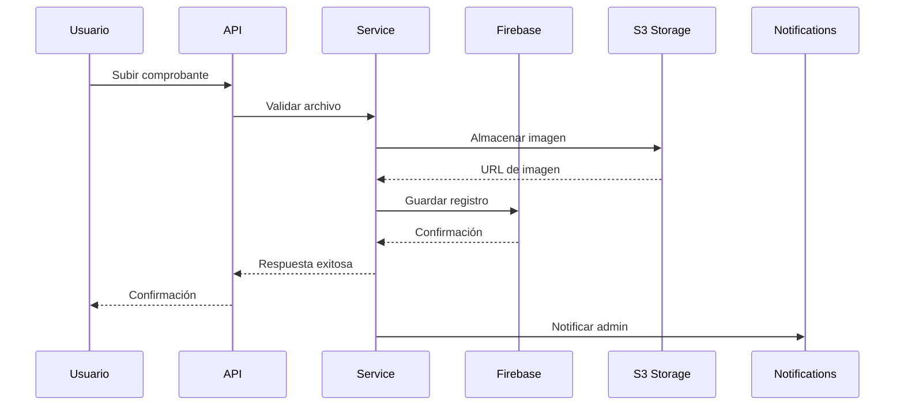
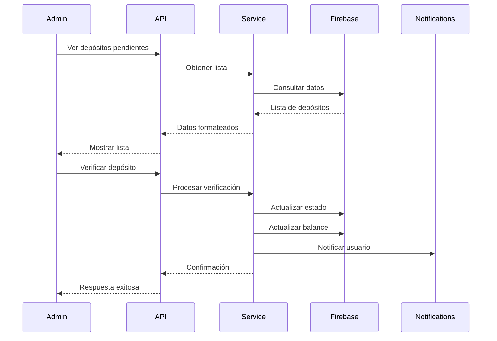

# Arquitectura del Sistema de Pagos

## 🏗️ Arquitectura General

El Sistema de Pagos de Mussikon sigue una arquitectura en capas bien definida, diseñada para ser escalable, mantenible y segura.

```
┌─────────────────────────────────────────────────────────────┐
│                    CLIENT LAYER                             │
│  ┌─────────────────┐  ┌─────────────────┐  ┌──────────────┐ │
│  │   Mobile App    │  │  Admin Panel    │  │  Third Party │ │
│  │   (React Native)│  │   (React/Web)   │  │     APIs     │ │
│  └─────────────────┘  └─────────────────┘  └──────────────┘ │
└─────────────────────────────────────────────────────────────┘
                                │
                                ▼
┌─────────────────────────────────────────────────────────────┐
│                    API GATEWAY LAYER                        │
│  ┌─────────────────────────────────────────────────────────┐ │
│  │              Express.js + TypeScript                    │ │
│  │  ┌─────────────┐  ┌─────────────┐  ┌─────────────────┐  │ │
│  │  │   Routes    │  │ Middleware  │  │   Controllers   │  │ │
│  │  │             │  │             │  │                 │  │ │
│  │  │ • Payment   │  │ • Auth      │  │ • Payment       │  │ │
│  │  │ • Images    │  │ • Roles     │  │ • Images        │  │ │
│  │  │ • Admin     │  │ • Upload    │  │ • Admin         │  │ │
│  │  └─────────────┘  └─────────────┘  └─────────────────┘  │ │
│  └─────────────────────────────────────────────────────────┘ │
└─────────────────────────────────────────────────────────────┘
                                │
                                ▼
┌─────────────────────────────────────────────────────────────┐
│                   BUSINESS LOGIC LAYER                      │
│  ┌─────────────────────────────────────────────────────────┐ │
│  │                    Services                              │ │
│  │  ┌─────────────────┐  ┌─────────────────────────────────┐ │ │
│  │  │ PaymentService  │  │ ImageService                    │ │ │
│  │  │                 │  │                                 │ │ │
│  │  │ • Deposits      │  │ • Upload                        │ │ │
│  │  │ • Withdrawals   │  │ • Validation                    │ │ │
│  │  │ • Balance       │  │ • Integrity                     │ │ │
│  │  │ • Verification  │  │ • Statistics                    │ │ │
│  │  └─────────────────┘  └─────────────────────────────────┘ │ │
│  └─────────────────────────────────────────────────────────┘ │
└─────────────────────────────────────────────────────────────┘
                                │
                                ▼
┌─────────────────────────────────────────────────────────────┐
│                   DATA ACCESS LAYER                         │
│  ┌─────────────────┐  ┌─────────────────┐  ┌──────────────┐ │
│  │   Firebase      │  │   AWS S3        │  │   External   │ │
│  │   Firestore     │  │  (idriveE2)     │  │   Services   │ │
│  │                 │  │                 │  │              │ │
│  │ • User Data     │  │ • Images        │  │ • Email      │ │
│  │ • Transactions  │  │ • Documents     │  │ • SMS        │ │
│  │ • Balances      │  │ • Vouchers      │  │ • Push       │ │
│  │ • Audit Logs    │  │ • Metadata      │  │ • Analytics  │ │
│  └─────────────────┘  └─────────────────┘  └──────────────┘ │
└─────────────────────────────────────────────────────────────┘
```

---

## 🔄 Flujo de Datos

### **1. Flujo de Depósito de Usuario**



### **2. Flujo de Verificación Administrativa**



---

## 🏛️ Patrones Arquitectónicos

### **1. Arquitectura en Capas**

```
┌─────────────────────────────────────┐
│           Presentation Layer        │
│  (Controllers + Routes)             │
├─────────────────────────────────────┤
│         Business Logic Layer        │
│      (Services)                     │
├─────────────────────────────────────┤
│         Data Access Layer           │
│  (Firebase + S3)                    │
└─────────────────────────────────────┘
```

### **2. Patrón Repository**

```typescript
// Ejemplo de patrón repository implementado
class PaymentRepository {
  async createDeposit(deposit: Deposit): Promise<Deposit>
  async getDepositsByUser(userId: string): Promise<Deposit[]>
  async updateDepositStatus(id: string, status: string): Promise<void>
  async getPendingDeposits(): Promise<Deposit[]>
}
```

### **3. Patrón Service Layer**

```typescript
// Ejemplo de service layer
class PaymentService {
  async uploadDepositVoucher(file: File, data: DepositData): Promise<Deposit>
  async verifyDeposit(depositId: string, verificationData: VerificationData): Promise<void>
  async getUserBalance(userId: string): Promise<Balance>
  async processWithdrawal(userId: string, amount: number): Promise<Withdrawal>
}
```

### **4. Patrón Middleware**

```typescript
// Middleware de autenticación
const authMiddleware = (req: Request, res: Response, next: NextFunction) => {
  // Validar JWT token
  // Verificar roles
  // Pasar al siguiente middleware
}

// Middleware de roles
const requireRole = (roles: string[]) => {
  return (req: Request, res: Response, next: NextFunction) => {
    // Verificar roles del usuario
    // Permitir o denegar acceso
  }
}
```

---

## 🔧 Componentes del Sistema

### **1. Controllers**

#### **PaymentSystemController**
```typescript
class PaymentSystemController {
  // Gestión de depósitos
  async uploadDepositVoucher(req: Request, res: Response)
  async getUserDeposits(req: Request, res: Response)
  async getUserBalance(req: Request, res: Response)
  
  // Gestión de retiros
  async requestWithdrawal(req: Request, res: Response)
  async getWithdrawalHistory(req: Request, res: Response)
  
  // Gestión de cuentas bancarias
  async registerBankAccount(req: Request, res: Response)
  async getUserBankAccounts(req: Request, res: Response)
}
```

#### **ImagesController**
```typescript
class ImagesController {
  // Gestión de imágenes
  async uploadImage(req: Request, res: Response)
  async getImage(req: Request, res: Response)
  async deleteImage(req: Request, res: Response)
  
  // Validación e integridad
  async validateImageFile(req: Request, res: Response)
  async verifyImageIntegrity(req: Request, res: Response)
  
  // Estadísticas
  async getImageStatistics(req: Request, res: Response)
  async cleanupUnusedImages(req: Request, res: Response)
}
```

### **2. Services**

#### **PaymentSystemService**
```typescript
class PaymentSystemService {
  // Constantes de validación
  private readonly MAX_DEPOSIT_AMOUNT = 1_000_000
  private readonly MIN_DEPOSIT_AMOUNT = 100
  private readonly MIN_WITHDRAWAL_AMOUNT = 500
  
  // Métodos principales
  async uploadDepositVoucher(file: File, data: DepositData): Promise<Deposit>
  async verifyDeposit(depositId: string, verificationData: VerificationData): Promise<void>
  async getUserBalance(userId: string): Promise<Balance>
  async processWithdrawal(userId: string, amount: number): Promise<Withdrawal>
  
  // Métodos de validación
  private validateDepositAmount(amount: number): boolean
  private validateVoucherFile(file: File): boolean
  private checkDuplicateDeposit(userId: string, amount: number): Promise<boolean>
}
```

#### **ImageService**
```typescript
class ImageService {
  // Constantes
  private readonly MAX_FILE_SIZE = 10 * 1024 * 1024 // 10MB
  private readonly ALLOWED_MIME_TYPES = ['image/jpeg', 'image/png', 'image/gif', 'image/webp', 'application/pdf']
  
  // Métodos principales
  async uploadImage(file: File, userId: string, folder: string): Promise<ImageUploadResult>
  async getImage(imageId: string): Promise<ImageUploadResult | null>
  async deleteImage(imageId: string): Promise<boolean>
  
  // Métodos de validación
  validateImageFile(file: File): ImageValidationResult
  async verifyImageIntegrity(imageId: string): Promise<ImageIntegrityResult>
  
  // Métodos de mantenimiento
  async getImageStatistics(userId?: string): Promise<ImageStatistics>
  async cleanupUnusedImages(daysOld: number): Promise<number>
}
```

### **3. Middleware**

#### **AuthMiddleware**
```typescript
const authMiddleware = async (req: Request, res: Response, next: NextFunction) => {
  try {
    const token = req.headers.authorization?.split(' ')[1]
    if (!token) {
      return res.status(401).json({ error: 'Token no proporcionado' })
    }
    
    const decoded = jwt.verify(token, process.env.JWT_SECRET!)
    req.user = decoded
    next()
  } catch (error) {
    return res.status(401).json({ error: 'Token inválido' })
  }
}
```

#### **RequireRole**
```typescript
const requireRole = (roles: string[]) => {
  return (req: Request, res: Response, next: NextFunction) => {
    if (!req.user) {
      return res.status(401).json({ error: 'Usuario no autenticado' })
    }
    
    if (!roles.includes(req.user.role)) {
      return res.status(403).json({ error: 'Acceso denegado' })
    }
    
    next()
  }
}
```

#### **UploadMiddleware**
```typescript
const uploadMiddleware = multer({
  storage: multer.memoryStorage(),
  limits: {
    fileSize: 10 * 1024 * 1024, // 10MB
  },
  fileFilter: (req, file, cb) => {
    const allowedTypes = ['image/jpeg', 'image/png', 'image/gif', 'image/webp', 'application/pdf']
    if (allowedTypes.includes(file.mimetype)) {
      cb(null, true)
    } else {
      cb(new Error('Tipo de archivo no permitido'))
    }
  }
})
```

---

## 🗄️ Modelo de Datos

### **1. Colecciones de Firestore**

#### **users**
```typescript
interface User {
  id: string
  email: string
  name: string
  role: 'user' | 'musician' | 'event_organizer' | 'admin' | 'superadmin' | 'senioradmin'
  balance: number
  createdAt: string
  updatedAt: string
}
```

#### **deposits**
```typescript
interface Deposit {
  id: string
  userId: string
  amount: number
  currency: string
  status: 'pending' | 'approved' | 'rejected'
  voucherFile: {
    url: string
    filename: string
    size: number
    mimeType: string
  }
  accountHolderName: string
  bankName: string
  depositDate: string
  depositTime: string
  referenceNumber: string
  comments?: string
  adminNotes?: string
  verifiedBy?: string
  verifiedAt?: string
  createdAt: string
  updatedAt: string
}
```

#### **withdrawals**
```typescript
interface Withdrawal {
  id: string
  userId: string
  amount: number
  currency: string
  status: 'pending' | 'approved' | 'rejected'
  bankAccountId: string
  reason?: string
  adminNotes?: string
  processedBy?: string
  processedAt?: string
  createdAt: string
  updatedAt: string
}
```

#### **bank_accounts**
```typescript
interface BankAccount {
  id: string
  userId: string
  accountHolder: string
  accountNumber: string
  bankName: string
  accountType: 'savings' | 'checking'
  routingNumber?: string
  isActive: boolean
  createdAt: string
  updatedAt: string
}
```

#### **image_uploads**
```typescript
interface ImageUpload {
  id: string
  url: string
  filename: string
  originalName: string
  size: number
  mimeType: string
  userId: string
  folder: string
  metadata?: Record<string, any>
  uploadedAt: string
  lastAccessed: string
  accessCount: number
}
```

### **2. Estructura de S3**

```
bucket-name/
├── uploads/
│   ├── user_123/
│   │   ├── 1703123456789_abc123_voucher.jpg
│   │   └── 1703123456790_def456_receipt.pdf
│   └── user_456/
│       └── 1703123456791_ghi789_document.png
├── profiles/
│   ├── user_123/
│   │   └── 1703123456792_jkl012_profile.jpg
│   └── user_456/
│       └── 1703123456793_mno345_avatar.png
└── temp/
    └── uploads_temporales/
```

---

## 🔒 Seguridad

### **1. Autenticación**

- **JWT Tokens**: Tokens seguros con expiración
- **Refresh Tokens**: Renovación automática de tokens
- **Session Management**: Gestión de sesiones activas

### **2. Autorización**

- **Role-Based Access Control (RBAC)**: Control de acceso por roles
- **Resource-Level Permissions**: Permisos granulares por recurso
- **API Rate Limiting**: Limitación de requests por usuario

### **3. Validación de Datos**

- **Input Validation**: Validación de entrada en múltiples capas
- **File Validation**: Validación de archivos (tipo, tamaño, contenido)
- **Business Logic Validation**: Validación de reglas de negocio

### **4. Protección de Datos**

- **Data Encryption**: Cifrado de datos sensibles
- **Secure File Storage**: Almacenamiento seguro en S3
- **Audit Logging**: Registro completo de todas las acciones

---

## 📊 Escalabilidad

### **1. Horizontal Scaling**

- **Load Balancing**: Distribución de carga entre múltiples instancias
- **Database Sharding**: Particionamiento de base de datos
- **CDN Integration**: Distribución de contenido estático

### **2. Vertical Scaling**

- **Resource Optimization**: Optimización de recursos
- **Caching Strategy**: Estrategia de caché en múltiples niveles
- **Database Indexing**: Índices optimizados para consultas frecuentes

### **3. Performance Optimization**

- **Lazy Loading**: Carga diferida de recursos
- **Image Optimization**: Optimización automática de imágenes
- **Query Optimization**: Optimización de consultas a base de datos

---

## 🔄 Monitoreo y Observabilidad

### **1. Logging**

```typescript
// Logs estructurados
logger.info('Depósito creado', {
  depositId: 'dep_123',
  userId: 'user_456',
  amount: 1000,
  currency: 'DOP',
  timestamp: new Date().toISOString()
})
```

### **2. Métricas**

- **Response Time**: Tiempo de respuesta de endpoints
- **Error Rate**: Tasa de errores
- **Throughput**: Capacidad de procesamiento
- **Resource Usage**: Uso de recursos del sistema

### **3. Alerting**

- **Error Alerts**: Alertas por errores críticos
- **Performance Alerts**: Alertas por degradación de rendimiento
- **Security Alerts**: Alertas por intentos de seguridad

---

## 🚀 Despliegue

### **1. Environments**

- **Development**: Entorno de desarrollo local
- **Staging**: Entorno de pruebas
- **Production**: Entorno de producción

### **2. CI/CD Pipeline**

```yaml
# Ejemplo de pipeline
stages:
  - test
  - build
  - deploy-staging
  - test-staging
  - deploy-production
```

### **3. Infrastructure**

- **Containerization**: Docker para empaquetado
- **Orchestration**: Kubernetes para orquestación
- **Cloud Platform**: AWS/GCP para infraestructura

---

*Documento actualizado: Enero 2024*
*Versión: 2.0*
*Arquitectura: COMPLETA* 