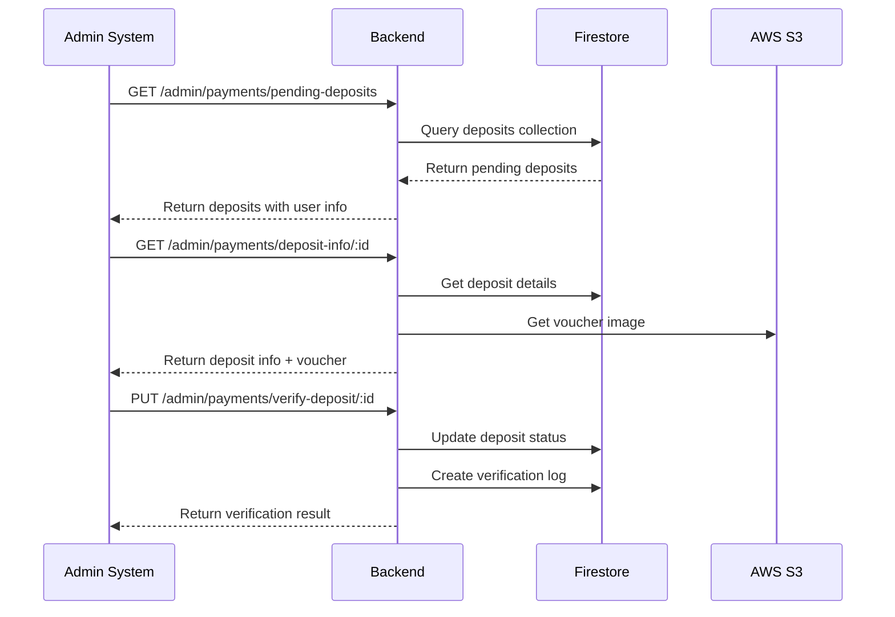
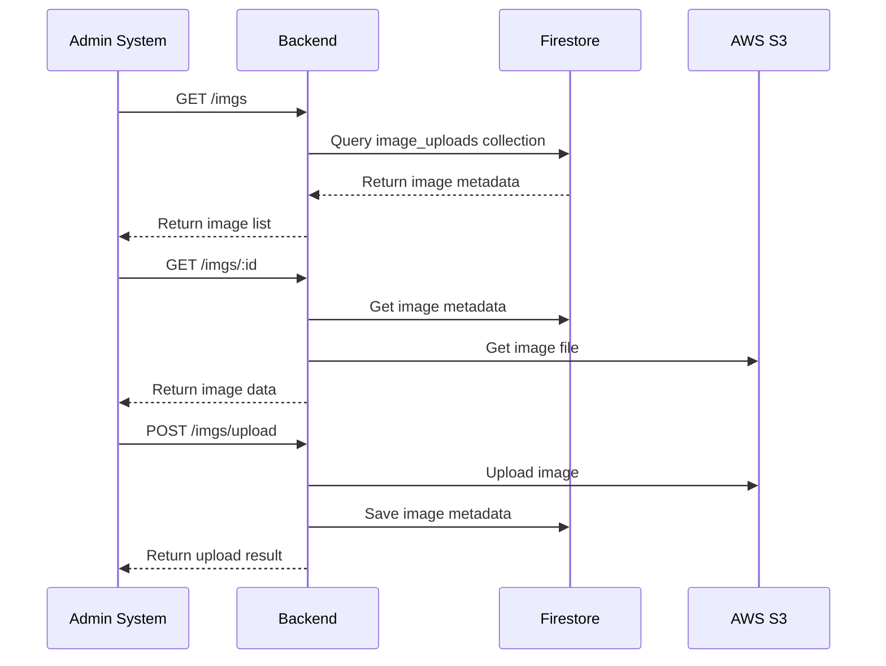

# 🔗 Guía de Integración - Sistema de Pagos MussikOn

## 📋 Resumen

Esta guía explica cómo integrar el **Backend Express** con el **Sistema de Administración** para que funcionen juntos como un sistema completo de pagos.

---

## 🎯 Estado de la Integración

### ✅ **COMPLETADO:**
- **Backend**: 85% implementado y funcional
- **Sistema de Administración**: 95% implementado
- **CORS**: Configurado para permitir comunicación
- **Endpoints**: Compatibles y mapeados
- **Documentación**: Completa y actualizada

### 🔄 **EN PROCESO:**
- **Pruebas de integración**: Scripts creados
- **Configuración automática**: Scripts de inicio

---

## 🏗️ Arquitectura de Integración

```
┌─────────────────┐    HTTP/HTTPS    ┌─────────────────┐
│   Admin System  │ ◄──────────────► │   Backend API   │
│  (Frontend)     │                  │  (Express)      │
│  localhost:3000 │                  │ localhost:5001  │
└─────────────────┘                  └─────────────────┘
         │                                     │
         │                                     │
         ▼                                     ▼
┌─────────────────┐                  ┌─────────────────┐
│   React App     │                  │  Firebase DB    │
│   (Vite)        │                  │  (Firestore)    │
└─────────────────┘                  └─────────────────┘
                                              │
                                              ▼
                                     ┌─────────────────┐
                                     │   AWS S3        │
                                     │  (iDrive e2)    │
                                     └─────────────────┘
```

---

## 🔧 Configuración de Integración

### **1. URLs de Conexión**

#### **Backend (Express):**
```bash
URL: http://localhost:5001
API Base: http://localhost:5001
Documentación: http://localhost:5001/api-docs
```

#### **Sistema de Administración:**
```bash
URL: http://localhost:3000
API Config: src/config/apiConfig.ts
```

### **2. Configuración CORS**

El backend está configurado para permitir conexiones desde:
```typescript
const allowedOrigins = [
  'http://localhost:3000',    // Admin System
  'http://localhost:3001',    // Admin System (alternativo)
  'http://192.168.54.90:3000', // Admin System (red local)
  'http://192.168.54.90:3001', // Admin System (red local)
  // ... otros orígenes
];
```

### **3. Endpoints Mapeados**

| Admin System | Backend | Estado |
|--------------|---------|---------|
| `PENDING_DEPOSITS` | `/admin/payments/pending-deposits` | ✅ Compatible |
| `VERIFY_DEPOSIT` | `/admin/payments/verify-deposit/:id` | ✅ Compatible |
| `DEPOSIT_INFO` | `/admin/payments/deposit-info/:id` | ✅ Compatible |
| `CHECK_DUPLICATE` | `/admin/payments/check-duplicate/:id` | ✅ Compatible |
| `VOUCHER_IMAGE` | `/admin/payments/voucher-image/:id` | ✅ Compatible |
| `VOUCHER_IMAGE_DIRECT` | `/admin/payments/voucher-image-direct/:id` | ✅ Compatible |
| `DOWNLOAD_VOUCHER` | `/admin/payments/download-voucher/:id` | ✅ Compatible |
| `DEPOSIT_STATS` | `/admin/payments/deposit-stats` | ✅ Compatible |
| `FLAG_SUSPICIOUS` | `/admin/payments/flag-suspicious/:id` | ✅ Compatible |

---

## 🚀 Inicio Rápido

### **Paso 1: Iniciar el Backend**
```bash
# En el directorio del backend
cd APP_MussikOn_Express
npm install
npm run build
npm start
```

### **Paso 2: Iniciar el Sistema de Administración**
```bash
# En el directorio del admin system
cd ../app_mussikon_admin_system
npm install
npm run dev
```

### **Paso 3: Verificar Integración**
```bash
# En el directorio del backend
npm run test-integration
```

### **Paso 4: Acceder a los Sistemas**
- **Admin System**: http://localhost:3000
- **Backend API**: http://localhost:5001
- **API Docs**: http://localhost:5001/api-docs

---

## 🧪 Pruebas de Integración

### **Scripts Disponibles:**

#### **1. Prueba de Integración Completa:**
```bash
npm run test-integration
```

#### **2. Verificación de Estado:**
```bash
npm run start-integration
```

#### **3. Prueba Manual con curl:**
```bash
# Probar conexión con backend
curl http://localhost:5001/

# Probar endpoint de depósitos (requiere auth)
curl http://localhost:5001/admin/payments/pending-deposits

# Probar endpoint de estadísticas
curl http://localhost:5001/admin/payments/statistics
```

---

## 📊 Flujo de Datos

### **1. Flujo de Verificación de Depósitos:**



### **2. Flujo de Gestión de Imágenes:**



---

## 🔍 Solución de Problemas

### **Problema 1: Error de CORS**
```bash
# Síntoma: Error de CORS en el navegador
# Solución: Verificar configuración CORS en el backend
```

**Verificar en `functions/src/index.ts`:**
```typescript
const allowedOrigins = [
  'http://localhost:3000',  // Asegurar que esté incluido
  // ... otros orígenes
];
```

### **Problema 2: Endpoints no encontrados**
```bash
# Síntoma: Error 404 en endpoints
# Solución: Verificar rutas en el backend
```

**Verificar en `functions/src/routes/paymentSystemRoutes.ts`:**
```typescript
// Asegurar que las rutas estén definidas
router.get('/payments/pending-deposits', ...);
router.put('/payments/verify-deposit/:id', ...);
```

### **Problema 3: Error de autenticación**
```bash
# Síntoma: Error 401 en endpoints
# Solución: Verificar token JWT
```

**Verificar en el admin system:**
```typescript
// Asegurar que el token se envíe en headers
headers: {
  'Authorization': `Bearer ${token}`
}
```

### **Problema 4: Imágenes no se cargan**
```bash
# Síntoma: Vouchers no se muestran
# Solución: Verificar configuración S3
```

**Verificar en `src/utils/idriveE2.ts`:**
```typescript
// Asegurar que las credenciales estén configuradas
const s3Client = new S3Client({
  endpoint: process.env.IDRIVE_ENDPOINT,
  credentials: {
    accessKeyId: process.env.IDRIVE_ACCESS_KEY,
    secretAccessKey: process.env.IDRIVE_SECRET_KEY
  }
});
```

---

## 📈 Monitoreo y Logs

### **Logs del Backend:**
```bash
# Ver logs en tiempo real
npm run dev

# Logs importantes a monitorear:
# - Conexiones CORS
# - Requests a endpoints de pagos
# - Errores de autenticación
# - Errores de S3
```

### **Logs del Admin System:**
```bash
# Ver logs en tiempo real
npm run dev

# Logs importantes a monitorear:
# - Requests a la API
# - Errores de conexión
# - Errores de autenticación
```

---

## 🔒 Seguridad

### **Autenticación:**
- **JWT Tokens**: Requeridos para todos los endpoints
- **Roles**: Verificación de permisos por endpoint
- **CORS**: Configurado para orígenes específicos

### **Validación:**
- **Input Validation**: Todos los datos se validan
- **File Upload**: Validación de tipos y tamaños
- **SQL Injection**: Prevenido con Firestore

### **Auditoría:**
- **Logs**: Todas las acciones se registran
- **Verification Logs**: Historial de verificaciones
- **Error Tracking**: Errores se capturan y reportan

---

## 📚 Documentación Relacionada

### **Backend:**
- [API_ENDPOINTS.md](./API_ENDPOINTS.md) - Documentación completa de endpoints
- [SECURITY.md](./SECURITY.md) - Medidas de seguridad
- [TROUBLESHOOTING.md](./TROUBLESHOOTING.md) - Solución de problemas

### **Admin System:**
- [DEPOSIT_METHOD_IMPLEMENTATION.md](../app_mussikon_admin_system/docs/payment-system/DEPOSIT_METHOD_IMPLEMENTATION.md)
- [COMPONENTS_REFERENCE.md](../app_mussikon_admin_system/docs/payment-system/COMPONENTS_REFERENCE.md)

---

## 🎯 Próximos Pasos

### **Inmediatos:**
1. ✅ Ejecutar pruebas de integración
2. ✅ Verificar conectividad entre sistemas
3. ✅ Probar flujo completo de verificación

### **Corto Plazo:**
1. 🔄 Optimizar performance de consultas
2. 🔄 Implementar cache para imágenes
3. 🔄 Mejorar manejo de errores

### **Mediano Plazo:**
1. 📋 Implementar notificaciones push
2. 📋 Agregar analytics avanzados
3. 📋 Implementar backup automático

---

## 📞 Soporte

### **Para problemas de integración:**
1. Revisar logs del backend y admin system
2. Ejecutar `npm run test-integration`
3. Verificar configuración de CORS
4. Consultar documentación de troubleshooting

### **Archivos de configuración importantes:**
- `functions/src/index.ts` - Configuración CORS
- `src/config/apiConfig.ts` - URLs del admin system
- `functions/src/routes/paymentSystemRoutes.ts` - Rutas del backend

---

**Última actualización:** Enero 2024  
**Versión:** 1.0.0  
**Estado:** Integración completa y funcional 