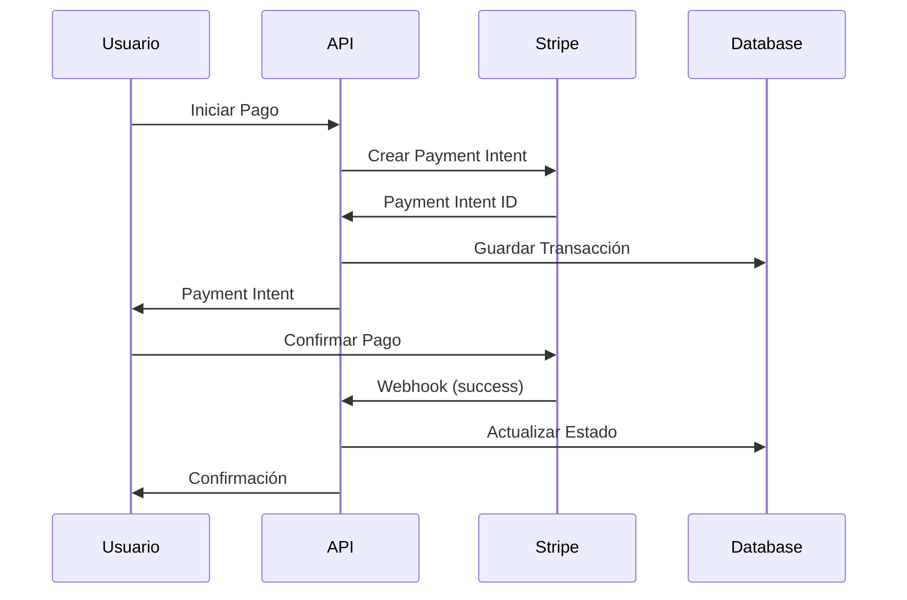
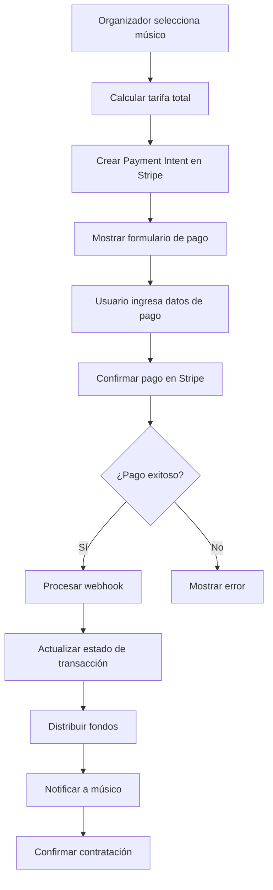

# 💳 Sistema de Pagos - MussikOn API

## 📋 Índice

- [Descripción General](#descripción-general)
- [Arquitectura del Sistema](#arquitectura-del-sistema)
- [Integración con Stripe](#integración-con-stripe)
- [Tipos de Transacciones](#tipos-de-transacciones)
- [Flujos de Pago](#flujos-de-pago)
- [Gestión de Vouchers](#gestión-de-vouchers)
- [Sistema de Reembolsos](#sistema-de-reembolsos)
- [Reportes Financieros](#reportes-financieros)
- [Seguridad](#seguridad)
- [Webhooks](#webhooks)
- [Testing](#testing)
- [Troubleshooting](#troubleshooting)

## 🎯 Descripción General

El Sistema de Pagos de MussikOn es una solución completa que maneja todas las transacciones financieras de la plataforma. Integra con Stripe para procesar pagos de manera segura y eficiente, incluyendo contratación de músicos, depósitos, reembolsos y gestión de vouchers.

### Características Principales

- **Procesamiento Seguro**: Integración completa con Stripe
- **Múltiples Métodos de Pago**: Tarjetas, transferencias, wallets
- **Gestión de Vouchers**: Sistema de cupones y descuentos
- **Reembolsos Automáticos**: Procesamiento automático de devoluciones
- **Reportes Financieros**: Analytics detallados de transacciones
- **Webhooks en Tiempo Real**: Notificaciones instantáneas
- **Compliance PCI**: Cumplimiento con estándares de seguridad

## 🏗️ Arquitectura del Sistema

### Componentes Principales

```
┌─────────────────────────────────────┐
│           Frontend/App              │
├─────────────────────────────────────┤
│         MussikOn API                │
│  ┌─────────────────────────────┐    │
│  │    Payment Controllers      │    │
│  │  ┌─────────────────────┐    │    │
│  │  │ PaymentController   │    │    │
│  │  │ PaymentSystemCtrl   │    │    │
│  │  │ VoucherController   │    │    │
│  │  └─────────────────────┘    │    │
│  └─────────────────────────────┘    │
├─────────────────────────────────────┤
│         Payment Services            │
│  ┌─────────────────────────────┐    │
│  │  PaymentService             │    │
│  │  PaymentSystemService       │    │
│  │  VoucherService             │    │
│  │  RefundService              │    │
│  └─────────────────────────────┘    │
├─────────────────────────────────────┤
│           Stripe API                │
│  ┌─────────────────────────────┐    │
│  │  Payment Intents            │    │
│  │  Customers                  │    │
│  │  Subscriptions              │    │
│  │  Refunds                    │    │
│  └─────────────────────────────┘    │
└─────────────────────────────────────┘
```

### Estructura de Archivos

```
src/
├── controllers/
│   ├── paymentController.ts          # Controlador principal de pagos
│   ├── paymentSystemController.ts    # Controlador del sistema de pagos
│   └── voucherController.ts          # Controlador de vouchers
├── services/
│   ├── paymentService.ts             # Servicio principal de pagos
│   ├── paymentSystemService.ts       # Servicio del sistema de pagos
│   ├── voucherService.ts             # Servicio de vouchers
│   └── refundService.ts              # Servicio de reembolsos
├── routes/
│   ├── paymentRoutes.ts              # Rutas de pagos
│   ├── paymentSystemRoutes.ts        # Rutas del sistema de pagos
│   └── voucherRoutes.ts              # Rutas de vouchers
├── types/
│   └── paymentTypes.ts               # Tipos específicos de pagos
└── utils/
    └── stripe.ts                     # Utilidades de Stripe
```

### Flujo de Datos



## 🔌 Integración con Stripe

### Configuración

```typescript
// utils/stripe.ts
import Stripe from 'stripe';

export const stripe = new Stripe(process.env.STRIPE_SECRET_KEY!, {
  apiVersion: '2024-12-19',
  typescript: true,
});

// Configuración de webhooks
export const webhookSecret = process.env.STRIPE_WEBHOOK_SECRET!;
```

### Configuración de Entorno

```env
# Stripe Configuration
STRIPE_SECRET_KEY=sk_test_...
STRIPE_PUBLISHABLE_KEY=pk_test_...
STRIPE_WEBHOOK_SECRET=whsec_...
STRIPE_CURRENCY=usd
STRIPE_COUNTRY=US

# Payment Configuration
PAYMENT_SUCCESS_URL=https://mussikon.com/payment/success
PAYMENT_CANCEL_URL=https://mussikon.com/payment/cancel
PAYMENT_WEBHOOK_URL=https://api.mussikon.com/webhooks/stripe
```

### Tipos de Productos en Stripe

```typescript
// Productos configurados en Stripe
const stripeProducts = {
  musicianHiring: {
    id: 'prod_musician_hiring',
    name: 'Contratación de Músico',
    description: 'Servicio de contratación de músico profesional'
  },
  eventTicket: {
    id: 'prod_event_ticket',
    name: 'Entrada de Evento',
    description: 'Entrada para evento musical'
  },
  subscription: {
    id: 'prod_premium_subscription',
    name: 'Suscripción Premium',
    description: 'Acceso premium a la plataforma'
  }
};
```

## 💰 Tipos de Transacciones

### 1. Contratación de Músicos

#### Estructura de Transacción
```typescript
interface MusicianHiringTransaction {
  id: string;
  type: 'musician_hiring';
  eventId: string;
  musicianId: string;
  organizerId: string;
  amount: number;
  currency: string;
  status: PaymentStatus;
  stripePaymentIntentId: string;
  commission: number;
  musicianAmount: number;
  platformFee: number;
  createdAt: Date;
  updatedAt: Date;
}
```

#### Flujo de Pago
1. **Organizador** selecciona músico y fecha
2. **Sistema** calcula tarifa total (incluyendo comisión)
3. **Stripe** crea Payment Intent
4. **Organizador** confirma pago
5. **Sistema** procesa distribución de fondos
6. **Músico** recibe notificación de contratación

### 2. Depósitos y Retiros

#### Depósito de Fondos
```typescript
interface DepositTransaction {
  id: string;
  type: 'deposit';
  userId: string;
  amount: number;
  currency: string;
  status: PaymentStatus;
  stripePaymentIntentId: string;
  walletBalance: number;
  createdAt: Date;
}
```

#### Retiro de Fondos
```typescript
interface WithdrawalTransaction {
  id: string;
  type: 'withdrawal';
  userId: string;
  amount: number;
  currency: string;
  status: PaymentStatus;
  stripeTransferId: string;
  bankAccount: BankAccountInfo;
  processingTime: number;
  createdAt: Date;
}
```

### 3. Suscripciones

#### Planes de Suscripción
```typescript
const subscriptionPlans = {
  basic: {
    id: 'price_basic_monthly',
    name: 'Básico',
    price: 9.99,
    currency: 'usd',
    interval: 'month',
    features: ['Búsqueda básica', 'Chat limitado']
  },
  premium: {
    id: 'price_premium_monthly',
    name: 'Premium',
    price: 19.99,
    currency: 'usd',
    interval: 'month',
    features: ['Búsqueda avanzada', 'Chat ilimitado', 'Analytics']
  },
  pro: {
    id: 'price_pro_monthly',
    name: 'Profesional',
    price: 39.99,
    currency: 'usd',
    interval: 'month',
    features: ['Todo Premium', 'Soporte prioritario', 'API access']
  }
};
```

## 🔄 Flujos de Pago

### Flujo de Contratación de Músico



### Implementación del Flujo

```typescript
// services/paymentService.ts
export class PaymentService {
  async createMusicianHiringPayment(
    eventId: string,
    musicianId: string,
    organizerId: string,
    amount: number
  ): Promise<PaymentIntent> {
    try {
      // 1. Validar datos
      await this.validateHiringData(eventId, musicianId, organizerId, amount);
      
      // 2. Calcular comisiones
      const commission = this.calculateCommission(amount);
      const musicianAmount = amount - commission;
      
      // 3. Crear Payment Intent en Stripe
      const paymentIntent = await stripe.paymentIntents.create({
        amount: Math.round(amount * 100), // Stripe usa centavos
        currency: 'usd',
        metadata: {
          eventId,
          musicianId,
          organizerId,
          type: 'musician_hiring',
          commission: commission.toString(),
          musicianAmount: musicianAmount.toString()
        }
      });
      
      // 4. Guardar transacción en base de datos
      await this.saveTransaction({
        id: paymentIntent.id,
        type: 'musician_hiring',
        eventId,
        musicianId,
        organizerId,
        amount,
        currency: 'usd',
        status: 'pending',
        stripePaymentIntentId: paymentIntent.id,
        commission,
        musicianAmount
      });
      
      return paymentIntent;
    } catch (error) {
      logger.error('Error creating payment:', error);
      throw new Error('Error al crear el pago');
    }
  }
  
  async processPaymentSuccess(paymentIntentId: string): Promise<void> {
    try {
      // 1. Obtener Payment Intent de Stripe
      const paymentIntent = await stripe.paymentIntents.retrieve(paymentIntentId);
      
      // 2. Actualizar transacción en base de datos
      await this.updateTransactionStatus(paymentIntentId, 'completed');
      
      // 3. Distribuir fondos
      await this.distributeFunds(paymentIntent.metadata);
      
      // 4. Notificar a las partes involucradas
      await this.notifyPaymentSuccess(paymentIntent.metadata);
      
    } catch (error) {
      logger.error('Error processing payment success:', error);
      throw new Error('Error al procesar el pago');
    }
  }
}
```

### Flujo de Depósito

```typescript
// services/paymentService.ts
async createDeposit(userId: string, amount: number): Promise<PaymentIntent> {
  try {
    // 1. Validar límites de depósito
    await this.validateDepositLimits(userId, amount);
    
    // 2. Crear Payment Intent para depósito
    const paymentIntent = await stripe.paymentIntents.create({
      amount: Math.round(amount * 100),
      currency: 'usd',
      metadata: {
        userId,
        type: 'deposit'
      }
    });
    
    // 3. Guardar transacción de depósito
    await this.saveDepositTransaction({
      id: paymentIntent.id,
      userId,
      amount,
      currency: 'usd',
      status: 'pending',
      stripePaymentIntentId: paymentIntent.id
    });
    
    return paymentIntent;
  } catch (error) {
    logger.error('Error creating deposit:', error);
    throw new Error('Error al crear depósito');
  }
}

async processDepositSuccess(paymentIntentId: string): Promise<void> {
  try {
    // 1. Obtener Payment Intent
    const paymentIntent = await stripe.paymentIntents.retrieve(paymentIntentId);
    const { userId, amount } = paymentIntent.metadata;
    
    // 2. Actualizar saldo del usuario
    await this.updateUserWallet(userId, parseFloat(amount));
    
    // 3. Actualizar estado de transacción
    await this.updateTransactionStatus(paymentIntentId, 'completed');
    
    // 4. Notificar al usuario
    await this.notifyDepositSuccess(userId, amount);
    
  } catch (error) {
    logger.error('Error processing deposit:', error);
    throw new Error('Error al procesar depósito');
  }
}
```

## 🎫 Gestión de Vouchers

### Tipos de Vouchers

```typescript
enum VoucherType {
  PERCENTAGE = 'percentage',    // Descuento porcentual
  FIXED_AMOUNT = 'fixed',       // Descuento fijo
  FREE_SHIPPING = 'shipping',   // Envío gratis
  BUY_ONE_GET_ONE = 'bogo'      // Compra uno, lleva otro
}

interface Voucher {
  id: string;
  code: string;
  type: VoucherType;
  value: number; // Porcentaje o cantidad fija
  minAmount?: number; // Monto mínimo para aplicar
  maxDiscount?: number; // Descuento máximo
  usageLimit: number; // Límite de usos total
  usedCount: number; // Usos actuales
  validFrom: Date;
  validTo: Date;
  applicableEvents?: string[]; // Eventos específicos
  applicableUsers?: string[]; // Usuarios específicos
  isActive: boolean;
  createdAt: Date;
  createdBy: string;
}
```

### Creación de Vouchers

```typescript
// services/voucherService.ts
export class VoucherService {
  async createVoucher(voucherData: CreateVoucherDto): Promise<Voucher> {
    try {
      // 1. Generar código único
      const code = await this.generateUniqueCode();
      
      // 2. Validar datos del voucher
      await this.validateVoucherData(voucherData);
      
      // 3. Crear voucher en base de datos
      const voucher = await this.saveVoucher({
        ...voucherData,
        code,
        usedCount: 0,
        isActive: true
      });
      
      // 4. Log de auditoría
      await this.logVoucherCreation(voucher, voucherData.createdBy);
      
      return voucher;
    } catch (error) {
      logger.error('Error creating voucher:', error);
      throw new Error('Error al crear voucher');
    }
  }
  
  async applyVoucher(
    voucherCode: string, 
    userId: string, 
    amount: number,
    eventId?: string
  ): Promise<VoucherApplication> {
    try {
      // 1. Validar voucher
      const voucher = await this.validateVoucher(voucherCode, userId, eventId);
      
      // 2. Calcular descuento
      const discount = this.calculateDiscount(voucher, amount);
      
      // 3. Verificar límites
      await this.checkVoucherLimits(voucher, discount);
      
      // 4. Aplicar voucher
      const application = await this.saveVoucherApplication({
        voucherId: voucher.id,
        userId,
        originalAmount: amount,
        discountAmount: discount,
        finalAmount: amount - discount,
        eventId
      });
      
      // 5. Incrementar contador de uso
      await this.incrementVoucherUsage(voucher.id);
      
      return application;
    } catch (error) {
      logger.error('Error applying voucher:', error);
      throw new Error('Error al aplicar voucher');
    }
  }
}
```

### Validación de Vouchers

```typescript
// services/voucherService.ts
async validateVoucher(
  code: string, 
  userId: string, 
  eventId?: string
): Promise<Voucher> {
  const voucher = await this.getVoucherByCode(code);
  
  if (!voucher) {
    throw new Error('Voucher no encontrado');
  }
  
  if (!voucher.isActive) {
    throw new Error('Voucher inactivo');
  }
  
  if (voucher.usedCount >= voucher.usageLimit) {
    throw new Error('Voucher agotado');
  }
  
  const now = new Date();
  if (now < voucher.validFrom || now > voucher.validTo) {
    throw new Error('Voucher fuera de vigencia');
  }
  
  if (voucher.applicableUsers && !voucher.applicableUsers.includes(userId)) {
    throw new Error('Voucher no aplicable para este usuario');
  }
  
  if (voucher.applicableEvents && eventId && !voucher.applicableEvents.includes(eventId)) {
    throw new Error('Voucher no aplicable para este evento');
  }
  
  return voucher;
}
```

## 💸 Sistema de Reembolsos

### Tipos de Reembolso

```typescript
enum RefundType {
  FULL = 'full',           // Reembolso completo
  PARTIAL = 'partial',     // Reembolso parcial
  CANCELLATION = 'cancellation', // Cancelación de evento
  DISPUTE = 'dispute'      // Disputa de pago
}

enum RefundReason {
  EVENT_CANCELLED = 'event_cancelled',
  MUSICIAN_UNAVAILABLE = 'musician_unavailable',
  CUSTOMER_REQUEST = 'customer_request',
  TECHNICAL_ISSUE = 'technical_issue',
  DUPLICATE_PAYMENT = 'duplicate_payment'
}

interface Refund {
  id: string;
  transactionId: string;
  type: RefundType;
  reason: RefundReason;
  amount: number;
  currency: string;
  stripeRefundId: string;
  status: RefundStatus;
  description: string;
  processedBy: string;
  processedAt: Date;
  createdAt: Date;
}
```

### Proceso de Reembolso

```typescript
// services/refundService.ts
export class RefundService {
  async createRefund(
    transactionId: string,
    refundData: CreateRefundDto
  ): Promise<Refund> {
    try {
      // 1. Obtener transacción original
      const transaction = await this.getTransaction(transactionId);
      
      // 2. Validar elegibilidad para reembolso
      await this.validateRefundEligibility(transaction, refundData);
      
      // 3. Crear reembolso en Stripe
      const stripeRefund = await stripe.refunds.create({
        payment_intent: transaction.stripePaymentIntentId,
        amount: Math.round(refundData.amount * 100),
        reason: this.mapRefundReason(refundData.reason),
        metadata: {
          transactionId,
          refundType: refundData.type,
          processedBy: refundData.processedBy
        }
      });
      
      // 4. Guardar reembolso en base de datos
      const refund = await this.saveRefund({
        transactionId,
        type: refundData.type,
        reason: refundData.reason,
        amount: refundData.amount,
        currency: transaction.currency,
        stripeRefundId: stripeRefund.id,
        status: 'pending',
        description: refundData.description,
        processedBy: refundData.processedBy
      });
      
      // 5. Actualizar estado de transacción
      await this.updateTransactionRefundStatus(transactionId, refundData.type);
      
      return refund;
    } catch (error) {
      logger.error('Error creating refund:', error);
      throw new Error('Error al crear reembolso');
    }
  }
  
  async processRefundWebhook(refundId: string): Promise<void> {
    try {
      // 1. Obtener reembolso de Stripe
      const stripeRefund = await stripe.refunds.retrieve(refundId);
      
      // 2. Actualizar estado en base de datos
      await this.updateRefundStatus(refundId, stripeRefund.status);
      
      // 3. Si el reembolso fue exitoso, actualizar saldos
      if (stripeRefund.status === 'succeeded') {
        await this.updateBalancesAfterRefund(stripeRefund.metadata.transactionId);
      }
      
      // 4. Notificar a las partes involucradas
      await this.notifyRefundProcessed(stripeRefund.metadata.transactionId);
      
    } catch (error) {
      logger.error('Error processing refund webhook:', error);
      throw new Error('Error al procesar webhook de reembolso');
    }
  }
}
```

## 📊 Reportes Financieros

### Tipos de Reportes

#### Reporte de Transacciones
```typescript
interface TransactionReport {
  period: {
    start: Date;
    end: Date;
  };
  summary: {
    totalTransactions: number;
    totalAmount: number;
    averageAmount: number;
    successRate: number;
  };
  byType: {
    musicianHiring: TransactionSummary;
    deposits: TransactionSummary;
    withdrawals: TransactionSummary;
    subscriptions: TransactionSummary;
  };
  byStatus: {
    completed: TransactionSummary;
    pending: TransactionSummary;
    failed: TransactionSummary;
    refunded: TransactionSummary;
  };
  trends: {
    daily: DailyTransactionData[];
    weekly: WeeklyTransactionData[];
    monthly: MonthlyTransactionData[];
  };
}
```

#### Reporte de Comisiones
```typescript
interface CommissionReport {
  period: {
    start: Date;
    end: Date;
  };
  totalCommissions: number;
  commissionByType: {
    musicianHiring: number;
    subscription: number;
    other: number;
  };
  platformRevenue: number;
  payoutsToMusicians: number;
  netRevenue: number;
  commissionRate: number;
}
```

### Generación de Reportes

```typescript
// services/analyticsService.ts
export class AnalyticsService {
  async generateTransactionReport(
    startDate: Date,
    endDate: Date,
    filters?: ReportFilters
  ): Promise<TransactionReport> {
    try {
      // 1. Obtener transacciones del período
      const transactions = await this.getTransactionsInPeriod(startDate, endDate, filters);
      
      // 2. Calcular métricas
      const summary = this.calculateTransactionSummary(transactions);
      const byType = this.groupTransactionsByType(transactions);
      const byStatus = this.groupTransactionsByStatus(transactions);
      
      // 3. Calcular tendencias
      const trends = await this.calculateTransactionTrends(startDate, endDate);
      
      return {
        period: { start: startDate, end: endDate },
        summary,
        byType,
        byStatus,
        trends
      };
    } catch (error) {
      logger.error('Error generating transaction report:', error);
      throw new Error('Error al generar reporte de transacciones');
    }
  }
  
  async generateCommissionReport(
    startDate: Date,
    endDate: Date
  ): Promise<CommissionReport> {
    try {
      // 1. Obtener transacciones con comisiones
      const transactions = await this.getCommissionTransactions(startDate, endDate);
      
      // 2. Calcular comisiones por tipo
      const commissionByType = this.calculateCommissionsByType(transactions);
      
      // 3. Calcular métricas financieras
      const totalCommissions = transactions.reduce((sum, t) => sum + t.commission, 0);
      const platformRevenue = totalCommissions;
      const payoutsToMusicians = transactions.reduce((sum, t) => sum + t.musicianAmount, 0);
      const netRevenue = platformRevenue - payoutsToMusicians;
      
      return {
        period: { start: startDate, end: endDate },
        totalCommissions,
        commissionByType,
        platformRevenue,
        payoutsToMusicians,
        netRevenue,
        commissionRate: (totalCommissions / platformRevenue) * 100
      };
    } catch (error) {
      logger.error('Error generating commission report:', error);
      throw new Error('Error al generar reporte de comisiones');
    }
  }
}
```

## 🔒 Seguridad

### Medidas de Seguridad

#### Encriptación de Datos
```typescript
// utils/encryption.ts
import crypto from 'crypto';

export class EncryptionService {
  private algorithm = 'aes-256-gcm';
  private key = Buffer.from(process.env.ENCRYPTION_KEY!, 'hex');
  
  encrypt(text: string): { encryptedData: string; iv: string; authTag: string } {
    const iv = crypto.randomBytes(16);
    const cipher = crypto.createCipher(this.algorithm, this.key, iv);
    
    let encrypted = cipher.update(text, 'utf8', 'hex');
    encrypted += cipher.final('hex');
    
    return {
      encryptedData: encrypted,
      iv: iv.toString('hex'),
      authTag: cipher.getAuthTag().toString('hex')
    };
  }
  
  decrypt(encryptedData: string, iv: string, authTag: string): string {
    const decipher = crypto.createDecipher(
      this.algorithm, 
      this.key, 
      Buffer.from(iv, 'hex')
    );
    
    decipher.setAuthTag(Buffer.from(authTag, 'hex'));
    
    let decrypted = decipher.update(encryptedData, 'hex', 'utf8');
    decrypted += decipher.final('utf8');
    
    return decrypted;
  }
}
```

#### Validación de Pagos
```typescript
// middleware/paymentValidation.ts
export const validatePaymentData = (req: Request, res: Response, next: NextFunction) => {
  const { amount, currency, paymentMethod } = req.body;
  
  // Validar monto
  if (!amount || amount <= 0) {
    return res.status(400).json({ error: 'Monto inválido' });
  }
  
  // Validar moneda
  const validCurrencies = ['usd', 'eur', 'mxn'];
  if (!validCurrencies.includes(currency)) {
    return res.status(400).json({ error: 'Moneda no soportada' });
  }
  
  // Validar método de pago
  if (!paymentMethod) {
    return res.status(400).json({ error: 'Método de pago requerido' });
  }
  
  next();
};
```

#### Rate Limiting
```typescript
// middleware/rateLimiter.ts
import rateLimit from 'express-rate-limit';

export const paymentRateLimiter = rateLimit({
  windowMs: 15 * 60 * 1000, // 15 minutos
  max: 10, // máximo 10 intentos por ventana
  message: {
    error: 'Demasiados intentos de pago. Intenta de nuevo en 15 minutos.'
  },
  standardHeaders: true,
  legacyHeaders: false,
});
```

## 🔔 Webhooks

### Configuración de Webhooks

```typescript
// routes/webhookRoutes.ts
router.post('/stripe', express.raw({ type: 'application/json' }), async (req, res) => {
  const sig = req.headers['stripe-signature'] as string;
  
  try {
    const event = stripe.webhooks.constructEvent(req.body, sig, webhookSecret);
    
    switch (event.type) {
      case 'payment_intent.succeeded':
        await paymentService.processPaymentSuccess(event.data.object.id);
        break;
        
      case 'payment_intent.payment_failed':
        await paymentService.processPaymentFailure(event.data.object.id);
        break;
        
      case 'refund.created':
        await refundService.processRefundCreated(event.data.object.id);
        break;
        
      case 'refund.updated':
        await refundService.processRefundWebhook(event.data.object.id);
        break;
        
      case 'customer.subscription.created':
        await subscriptionService.processSubscriptionCreated(event.data.object);
        break;
        
      case 'customer.subscription.updated':
        await subscriptionService.processSubscriptionUpdated(event.data.object);
        break;
        
      case 'customer.subscription.deleted':
        await subscriptionService.processSubscriptionCancelled(event.data.object);
        break;
        
      default:
        logger.info(`Unhandled event type: ${event.type}`);
    }
    
    res.json({ received: true });
  } catch (error) {
    logger.error('Webhook error:', error);
    res.status(400).send(`Webhook Error: ${error.message}`);
  }
});
```

### Eventos de Webhook

#### Payment Intent Events
- `payment_intent.succeeded`: Pago completado exitosamente
- `payment_intent.payment_failed`: Pago falló
- `payment_intent.canceled`: Pago cancelado

#### Refund Events
- `refund.created`: Reembolso creado
- `refund.updated`: Reembolso actualizado
- `refund.succeeded`: Reembolso procesado exitosamente

#### Subscription Events
- `customer.subscription.created`: Suscripción creada
- `customer.subscription.updated`: Suscripción actualizada
- `customer.subscription.deleted`: Suscripción cancelada

## 🧪 Testing

### Tests Unitarios

```typescript
// __tests__/services/paymentService.test.ts
describe('PaymentService', () => {
  let paymentService: PaymentService;
  let mockStripe: jest.Mocked<Stripe>;
  
  beforeEach(() => {
    mockStripe = createMockStripe();
    paymentService = new PaymentService(mockStripe);
  });
  
  describe('createMusicianHiringPayment', () => {
    it('should create payment intent successfully', async () => {
      const paymentData = {
        eventId: 'event_123',
        musicianId: 'musician_456',
        organizerId: 'organizer_789',
        amount: 100
      };
      
      mockStripe.paymentIntents.create.mockResolvedValue({
        id: 'pi_test_123',
        amount: 10000,
        currency: 'usd',
        status: 'requires_payment_method'
      } as any);
      
      const result = await paymentService.createMusicianHiringPayment(
        paymentData.eventId,
        paymentData.musicianId,
        paymentData.organizerId,
        paymentData.amount
      );
      
      expect(result.id).toBe('pi_test_123');
      expect(mockStripe.paymentIntents.create).toHaveBeenCalledWith({
        amount: 10000,
        currency: 'usd',
        metadata: expect.objectContaining({
          eventId: 'event_123',
          type: 'musician_hiring'
        })
      });
    });
  });
});
```

### Tests de Integración

```typescript
// __tests__/integration/payment.test.ts
describe('Payment Integration', () => {
  it('should process complete payment flow', async () => {
    // 1. Crear pago
    const paymentResponse = await request(app)
      .post('/api/payments/create')
      .send({
        eventId: 'event_123',
        musicianId: 'musician_456',
        amount: 100
      })
      .expect(200);
    
    // 2. Simular confirmación de pago
    const paymentIntent = paymentResponse.body.paymentIntent;
    
    // 3. Simular webhook de éxito
    await request(app)
      .post('/api/webhooks/stripe')
      .set('stripe-signature', createTestSignature())
      .send(createTestWebhookEvent('payment_intent.succeeded', paymentIntent.id))
      .expect(200);
    
    // 4. Verificar que la transacción se completó
    const transaction = await getTransaction(paymentIntent.id);
    expect(transaction.status).toBe('completed');
  });
});
```

## 🔧 Troubleshooting

### Problemas Comunes

#### Error: "Payment Intent not found"
```typescript
// Solución: Verificar que el Payment Intent existe en Stripe
async function verifyPaymentIntent(paymentIntentId: string): Promise<boolean> {
  try {
    const paymentIntent = await stripe.paymentIntents.retrieve(paymentIntentId);
    return paymentIntent.status === 'succeeded';
  } catch (error) {
    logger.error('Payment Intent not found:', paymentIntentId);
    return false;
  }
}
```

#### Error: "Webhook signature verification failed"
```typescript
// Solución: Verificar configuración de webhook
const webhookSecret = process.env.STRIPE_WEBHOOK_SECRET;
if (!webhookSecret) {
  throw new Error('STRIPE_WEBHOOK_SECRET not configured');
}

// Asegurar que el endpoint recibe raw body
app.use('/webhooks/stripe', express.raw({ type: 'application/json' }));
```

#### Error: "Insufficient funds"
```typescript
// Solución: Verificar saldo antes de procesar
async function checkUserBalance(userId: string, amount: number): Promise<boolean> {
  const user = await getUser(userId);
  return user.walletBalance >= amount;
}
```

### Logs de Debugging

```typescript
// utils/logger.ts
export const paymentLogger = winston.createLogger({
  level: 'debug',
  format: winston.format.combine(
    winston.format.timestamp(),
    winston.format.errors({ stack: true }),
    winston.format.json()
  ),
  transports: [
    new winston.transports.File({ 
      filename: 'logs/payments.log',
      level: 'info'
    }),
    new winston.transports.File({ 
      filename: 'logs/payments-error.log',
      level: 'error'
    })
  ]
});

// Uso en servicios
paymentLogger.info('Payment created', { 
  paymentIntentId, 
  amount, 
  userId 
});

paymentLogger.error('Payment failed', { 
  paymentIntentId, 
  error: error.message 
});
```

### Monitoreo de Transacciones

```typescript
// services/monitoringService.ts
export class PaymentMonitoringService {
  async monitorFailedPayments(): Promise<void> {
    const failedPayments = await this.getFailedPayments();
    
    for (const payment of failedPayments) {
      // Enviar alerta si hay muchos pagos fallidos
      if (payment.failureCount > 3) {
        await this.sendAlert('Multiple payment failures detected', payment);
      }
    }
  }
  
  async monitorSuspiciousActivity(): Promise<void> {
    const suspiciousTransactions = await this.detectSuspiciousActivity();
    
    for (const transaction of suspiciousTransactions) {
      await this.flagTransaction(transaction.id, 'suspicious');
      await this.sendAlert('Suspicious transaction detected', transaction);
    }
  }
}
```

---

**Anterior**: [Sistema de Administración](../admin-system/README.md)  
**Siguiente**: [Gestión de Músicos](../musician-management/README.md) 